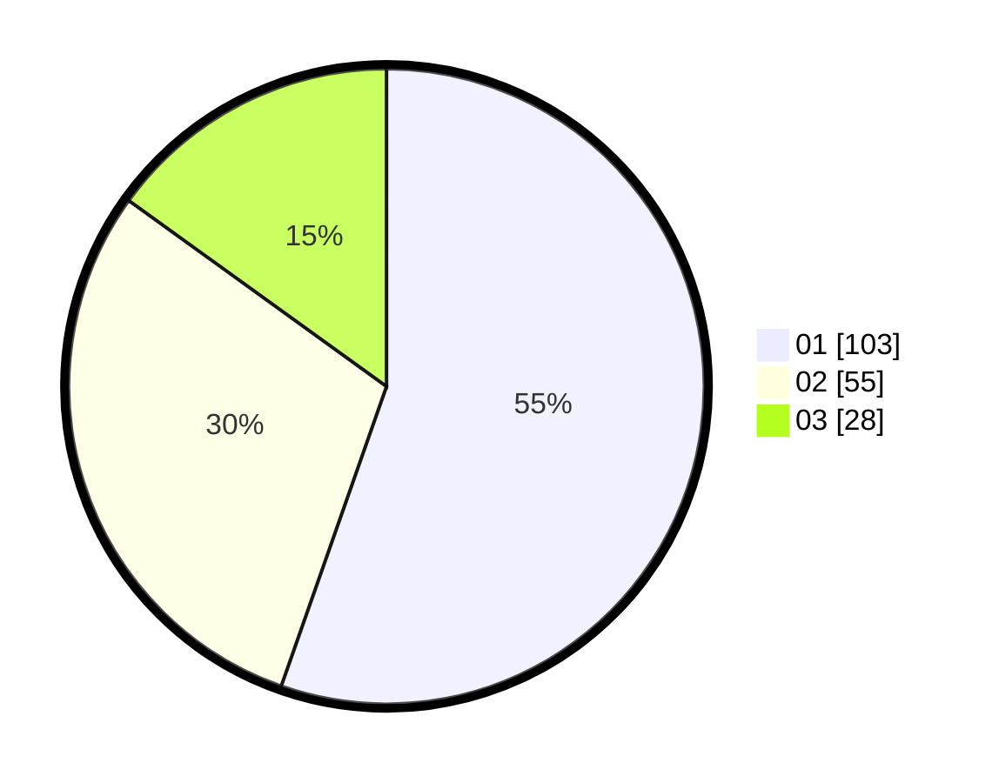

# Hasil

Hasil perolehan suara paslon dapat dilihat pada file paslon-01.txt, paslon-02.txt, dan paslon-03.txt.

Jika tidak ada, artinya data tersebut belum ada pada SIREKAP.

## Perolehan Suara

 * Paslon 01: **103**.
 * Paslon 02: **55**.
 * Paslon 03: **28**.

## Foto C Plano

https://sirekap-obj-formc.kpu.go.id/0d5a/pemilu/ppwp/31/73/08/10/05/3173081005121-20240215-073739--e7d3bbd6-21d1-45c1-87ce-b19534829b0a.jpg

https://sirekap-obj-formc.kpu.go.id/0d5a/pemilu/ppwp/31/73/08/10/05/3173081005121-20240215-073952--61fc394e-d93e-4e70-8b2f-aaaf057f0ebd.jpg

https://sirekap-obj-formc.kpu.go.id/0d5a/pemilu/ppwp/31/73/08/10/05/3173081005121-20240214-234034--202f7198-501b-475c-bc93-e775df2ea5b1.jpg

## DATA PEMILIH TETAP

Jumlah pemilih dalam DPT: **241**.
 * L: **114**.
 * P: **127**.

## DATA PENGGUNA HAK PILIH

Jumlah pengguna hak pilih dalam DPT: **181**.
 * L: **84**.
 * P: **97**.

Jumlah pengguna hak pilih dalam DPTb: **5**.
 * L: **1**.
 * P: **4**.

Jumlah pengguna hak pilih dalam DPK: **3**.
 * L: **3**.
 * P: **0**.

Jumlah pengguna hak pilih: **189**.
 * L: **88**.
 * P: **101**.

## JUMLAH SUARA SAH DAN TIDAK SAH

JUMLAH SELURUH SUARA SAH: **126**.

JUMLAH SUARA TIDAK SAH: **3**.

JUMLAH SELURUH SUARA SAH DAN SUARA TIDAK SAH: **129**.
