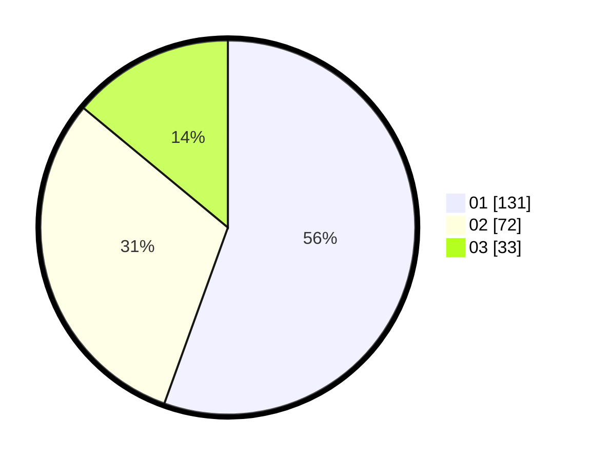

# Hasil

Hasil perolehan suara paslon dapat dilihat pada file paslon-01.txt, paslon-02.txt, dan paslon-03.txt.

Jika tidak ada, artinya data tersebut belum ada pada SIREKAP.

## Perolehan Suara

 * Paslon 01: **131**.
 * Paslon 02: **72**.
 * Paslon 03: **33**.

## Foto C Plano

https://sirekap-obj-formc.kpu.go.id/607a/pemilu/ppwp/31/73/08/10/05/3173081005127-20240214-202950--ca46c819-c6bc-4291-af54-3ef53f20df01.jpg

https://sirekap-obj-formc.kpu.go.id/607a/pemilu/ppwp/31/73/08/10/05/3173081005127-20240214-203230--1fac6810-e140-4c87-92a3-1f5fd043e76b.jpg

https://sirekap-obj-formc.kpu.go.id/607a/pemilu/ppwp/31/73/08/10/05/3173081005127-20240214-203440--187dd725-8571-4c67-8a20-5bf706a90d71.jpg

## DATA PEMILIH TETAP

Jumlah pemilih dalam DPT: **285**.
 * L: **148**.
 * P: **137**.

## DATA PENGGUNA HAK PILIH

Jumlah pengguna hak pilih dalam DPT: **232**.
 * L: **119**.
 * P: **113**.

Jumlah pengguna hak pilih dalam DPTb: **1**.
 * L: **0**.
 * P: **1**.

Jumlah pengguna hak pilih dalam DPK: **6**.
 * L: **4**.
 * P: **2**.

Jumlah pengguna hak pilih: **239**.
 * L: **123**.
 * P: **116**.

## JUMLAH SUARA SAH DAN TIDAK SAH

JUMLAH SELURUH SUARA SAH: **236**.

JUMLAH SUARA TIDAK SAH: **3**.

JUMLAH SELURUH SUARA SAH DAN SUARA TIDAK SAH: **239**.
