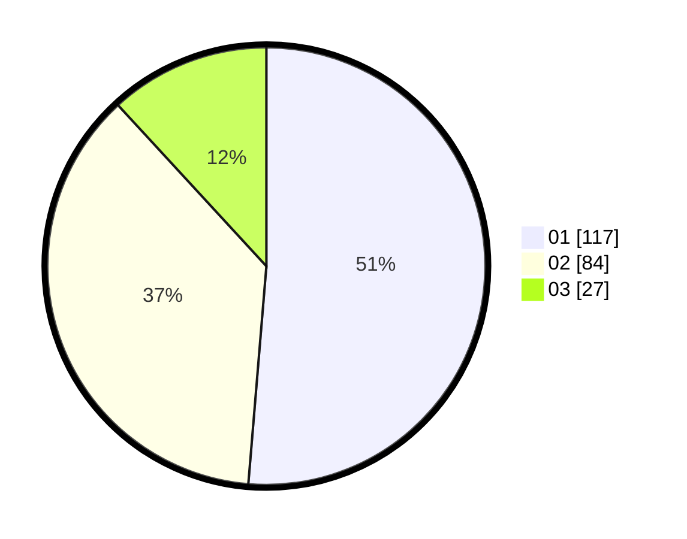

# Hasil

Hasil perolehan suara paslon dapat dilihat pada file paslon-01.txt, paslon-02.txt, dan paslon-03.txt.

Jika tidak ada, artinya data tersebut belum ada pada SIREKAP.

## Perolehan Suara

 * Paslon 01: **117**.
 * Paslon 02: **84**.
 * Paslon 03: **27**.

## Foto C Plano

https://sirekap-obj-formc.kpu.go.id/b73e/pemilu/ppwp/31/73/08/10/05/3173081005128-20240214-235228--834915ca-2b07-4bd3-9fdb-8c0eb8351908.jpg

https://sirekap-obj-formc.kpu.go.id/b73e/pemilu/ppwp/31/73/08/10/05/3173081005128-20240214-235520--e8472bb9-319c-4e9a-a423-653762a36bc2.jpg

https://sirekap-obj-formc.kpu.go.id/b73e/pemilu/ppwp/31/73/08/10/05/3173081005128-20240214-235720--fc35ec3c-9acf-4887-88bf-7b5c88d5d431.jpg
