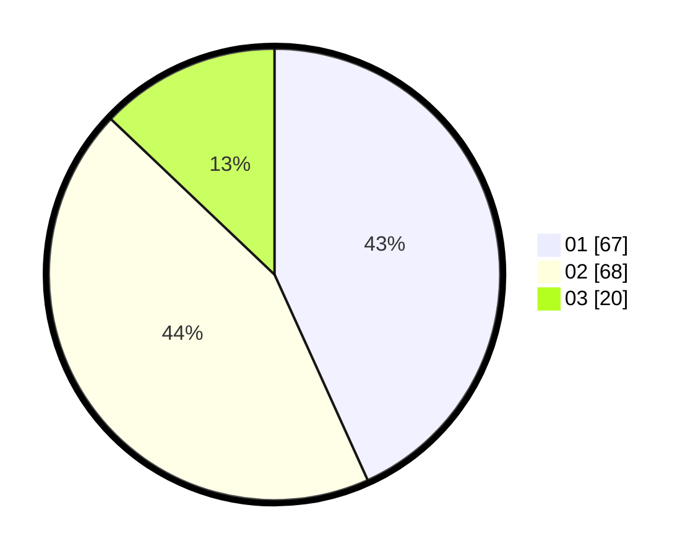

# Hasil

Hasil perolehan suara paslon dapat dilihat pada file paslon-01.txt, paslon-02.txt, dan paslon-03.txt.

Jika tidak ada, artinya data tersebut belum ada pada SIREKAP.

## Perolehan Suara

 * Paslon 01: **67**.
 * Paslon 02: **68**.
 * Paslon 03: **20**.

## Foto C Plano

https://sirekap-obj-formc.kpu.go.id/01be/pemilu/ppwp/31/73/08/10/05/3173081005131-20240216-160002--f0eeac6d-1792-42ad-a715-ed7abaddc10d.jpg

https://sirekap-obj-formc.kpu.go.id/01be/pemilu/ppwp/31/73/08/10/05/3173081005131-20240216-160004--37fe28f3-8375-4775-b246-91979173eec8.jpg

https://sirekap-obj-formc.kpu.go.id/01be/pemilu/ppwp/31/73/08/10/05/3173081005131-20240216-160003--b47cdac0-6931-412a-9ff2-e4b0b8367a19.jpg

## DATA PEMILIH TETAP

Jumlah pemilih dalam DPT: **233**.
 * L: **120**.
 * P: **113**.

## DATA PENGGUNA HAK PILIH

Jumlah pengguna hak pilih dalam DPT: **154**.
 * L: **77**.
 * P: **77**.

Jumlah pengguna hak pilih dalam DPTb: **1**.
 * L: **1**.
 * P: **0**.

Jumlah pengguna hak pilih dalam DPK: **2**.
 * L: **1**.
 * P: **1**.

Jumlah pengguna hak pilih: **157**.
 * L: **79**.
 * P: **78**.

## JUMLAH SUARA SAH DAN TIDAK SAH

JUMLAH SELURUH SUARA SAH: **155**.

JUMLAH SUARA TIDAK SAH: **2**.

JUMLAH SELURUH SUARA SAH DAN SUARA TIDAK SAH: **157**.
