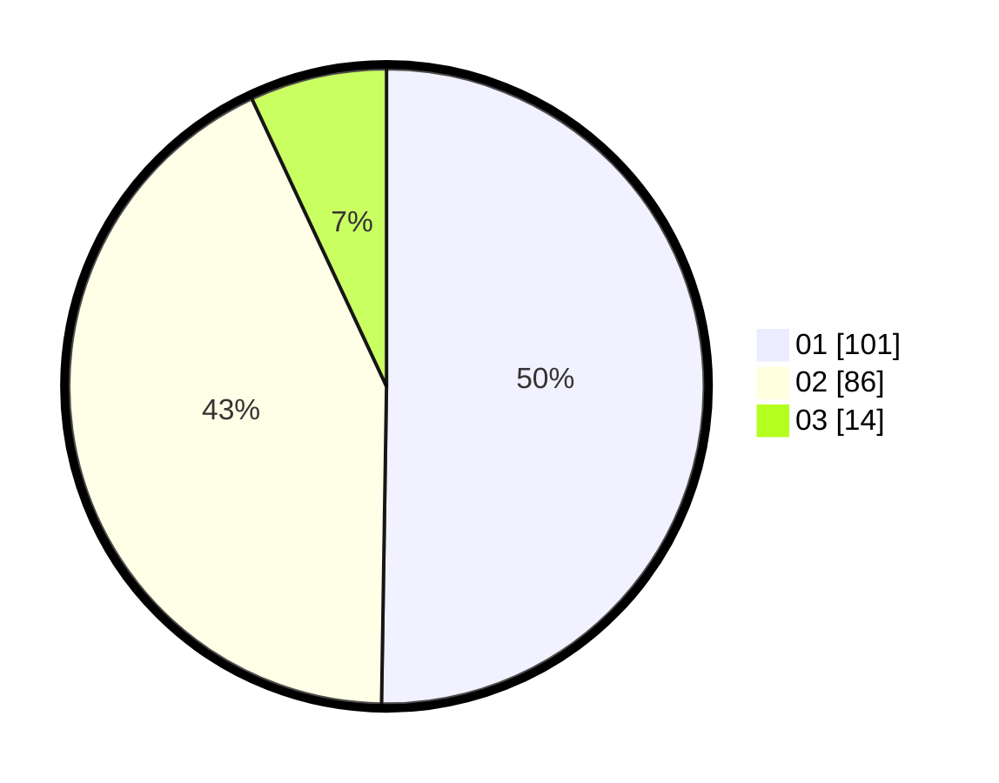

# Hasil

Hasil perolehan suara paslon dapat dilihat pada file paslon-01.txt, paslon-02.txt, dan paslon-03.txt.

Jika tidak ada, artinya data tersebut belum ada pada SIREKAP.

## Perolehan Suara

 * Paslon 01: **101**.
 * Paslon 02: **86**.
 * Paslon 03: **14**.

## Foto C Plano

https://sirekap-obj-formc.kpu.go.id/7232/pemilu/ppwp/31/73/08/10/05/3173081005134-20240216-132716--14ab54eb-236e-435d-8837-ec03025ada3f.jpg

https://sirekap-obj-formc.kpu.go.id/7232/pemilu/ppwp/31/73/08/10/05/3173081005134-20240214-225335--9e24dc23-36a6-4cf1-a462-5cc4e7e8f532.jpg

https://sirekap-obj-formc.kpu.go.id/7232/pemilu/ppwp/31/73/08/10/05/3173081005134-20240216-132716--e42a7550-bd54-44f7-b2cb-4d2d456305cc.jpg

## DATA PEMILIH TETAP

Jumlah pemilih dalam DPT: **278**.
 * L: **134**.
 * P: **144**.

## DATA PENGGUNA HAK PILIH

Jumlah pengguna hak pilih dalam DPT: **199**.
 * L: **93**.
 * P: **106**.

Jumlah pengguna hak pilih dalam DPTb: **1**.
 * L: **1**.
 * P: **0**.

Jumlah pengguna hak pilih dalam DPK: **2**.
 * L: **1**.
 * P: **1**.

Jumlah pengguna hak pilih: **202**.
 * L: **95**.
 * P: **107**.

## JUMLAH SUARA SAH DAN TIDAK SAH

JUMLAH SELURUH SUARA SAH: **201**.

JUMLAH SUARA TIDAK SAH: **1**.

JUMLAH SELURUH SUARA SAH DAN SUARA TIDAK SAH: **202**.
