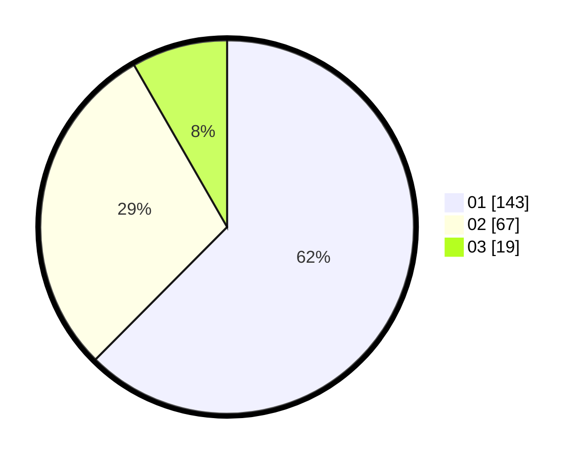

# Hasil

Hasil perolehan suara paslon dapat dilihat pada file paslon-01.txt, paslon-02.txt, dan paslon-03.txt.

Jika tidak ada, artinya data tersebut belum ada pada SIREKAP.

## Perolehan Suara

 * Paslon 01: **143**.
 * Paslon 02: **67**.
 * Paslon 03: **19**.

## Foto C Plano

https://sirekap-obj-formc.kpu.go.id/6a63/pemilu/ppwp/31/73/08/10/05/3173081005135-20240214-210139--f7865e31-e09d-4dd1-80b7-83909c031ee1.jpg

https://sirekap-obj-formc.kpu.go.id/6a63/pemilu/ppwp/31/73/08/10/05/3173081005135-20240214-194453--95d32ced-c4da-4dc5-9e6a-9041c4ec2fd8.jpg
