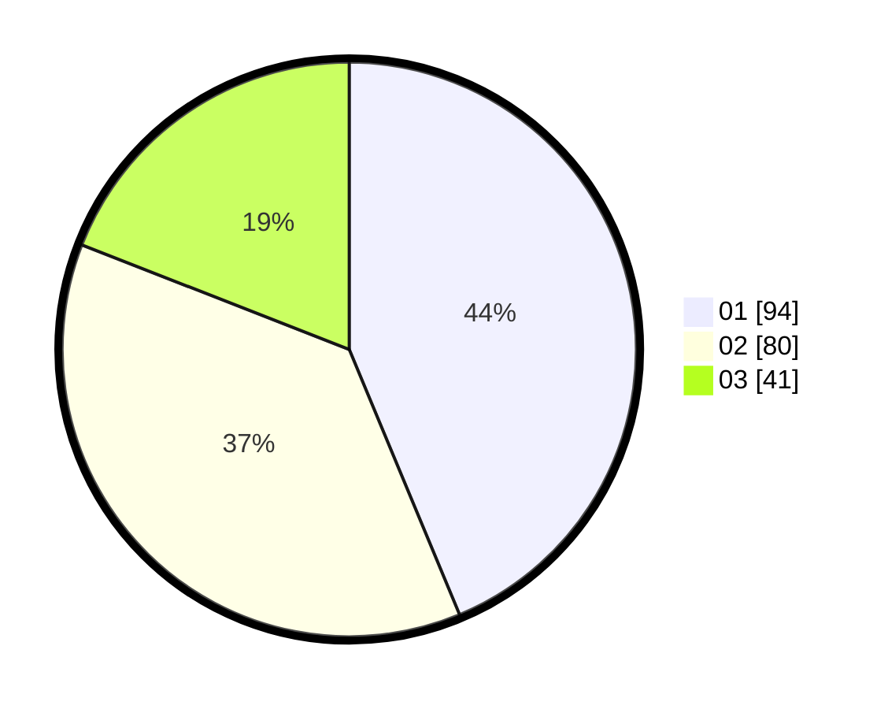

# Hasil

Hasil perolehan suara paslon dapat dilihat pada file paslon-01.txt, paslon-02.txt, dan paslon-03.txt.

Jika tidak ada, artinya data tersebut belum ada pada SIREKAP.

## Perolehan Suara

 * Paslon 01: **94**.
 * Paslon 02: **80**.
 * Paslon 03: **41**.

## Foto C Plano

https://sirekap-obj-formc.kpu.go.id/b2ad/pemilu/ppwp/31/73/08/10/05/3173081005137-20240214-202921--895c1aed-9ebc-4d19-b14a-22c38456aa9e.jpg

https://sirekap-obj-formc.kpu.go.id/b2ad/pemilu/ppwp/31/73/08/10/05/3173081005137-20240214-203010--9f7e6b7d-b8cc-4416-bdf9-6534249bcee5.jpg

https://sirekap-obj-formc.kpu.go.id/b2ad/pemilu/ppwp/31/73/08/10/05/3173081005137-20240214-203101--ad46e2b2-615d-4195-8f5a-5141d4e37231.jpg

## DATA PEMILIH TETAP

Jumlah pemilih dalam DPT: **278**.
 * L: **140**.
 * P: **138**.

## DATA PENGGUNA HAK PILIH

Jumlah pengguna hak pilih dalam DPT: **217**.
 * L: **107**.
 * P: **110**.

Jumlah pengguna hak pilih dalam DPTb: **0**.
 * L: **0**.
 * P: **0**.

Jumlah pengguna hak pilih dalam DPK: **0**.
 * L: **0**.
 * P: **0**.

Jumlah pengguna hak pilih: **217**.
 * L: **107**.
 * P: **110**.

## JUMLAH SUARA SAH DAN TIDAK SAH

JUMLAH SELURUH SUARA SAH: **215**.

JUMLAH SUARA TIDAK SAH: **2**.

JUMLAH SELURUH SUARA SAH DAN SUARA TIDAK SAH: **217**.
