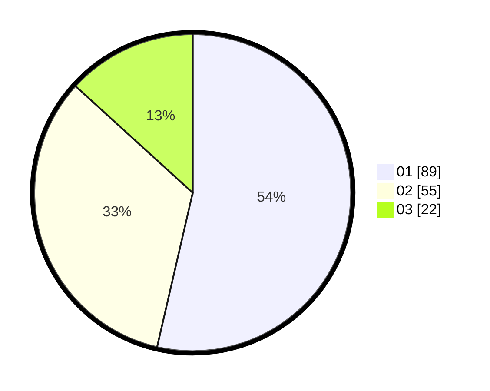

# Hasil

Hasil perolehan suara paslon dapat dilihat pada file paslon-01.txt, paslon-02.txt, dan paslon-03.txt.

Jika tidak ada, artinya data tersebut belum ada pada SIREKAP.

## Perolehan Suara

 * Paslon 01: **89**.
 * Paslon 02: **55**.
 * Paslon 03: **22**.

## Foto C Plano

https://sirekap-obj-formc.kpu.go.id/3ccc/pemilu/ppwp/31/73/08/10/05/3173081005138-20240214-184537--6662867a-10d7-4457-9b8e-187cff5505fd.jpg

https://sirekap-obj-formc.kpu.go.id/3ccc/pemilu/ppwp/31/73/08/10/05/3173081005138-20240214-185124--1d2163cb-0bab-45d2-89bc-0aee554ea5d9.jpg

https://sirekap-obj-formc.kpu.go.id/3ccc/pemilu/ppwp/31/73/08/10/05/3173081005138-20240214-185356--4266ee7d-4825-480b-8d3a-dec5d80e2d4a.jpg

## DATA PEMILIH TETAP

Jumlah pemilih dalam DPT: **256**.
 * L: **132**.
 * P: **124**.

## DATA PENGGUNA HAK PILIH

Jumlah pengguna hak pilih dalam DPT: **158**.
 * L: **78**.
 * P: **80**.

Jumlah pengguna hak pilih dalam DPTb: **3**.
 * L: **1**.
 * P: **2**.

Jumlah pengguna hak pilih dalam DPK: **7**.
 * L: **4**.
 * P: **3**.

Jumlah pengguna hak pilih: **168**.
 * L: **83**.
 * P: **85**.

## JUMLAH SUARA SAH DAN TIDAK SAH

JUMLAH SELURUH SUARA SAH: **166**.

JUMLAH SUARA TIDAK SAH: **2**.

JUMLAH SELURUH SUARA SAH DAN SUARA TIDAK SAH: **168**.
