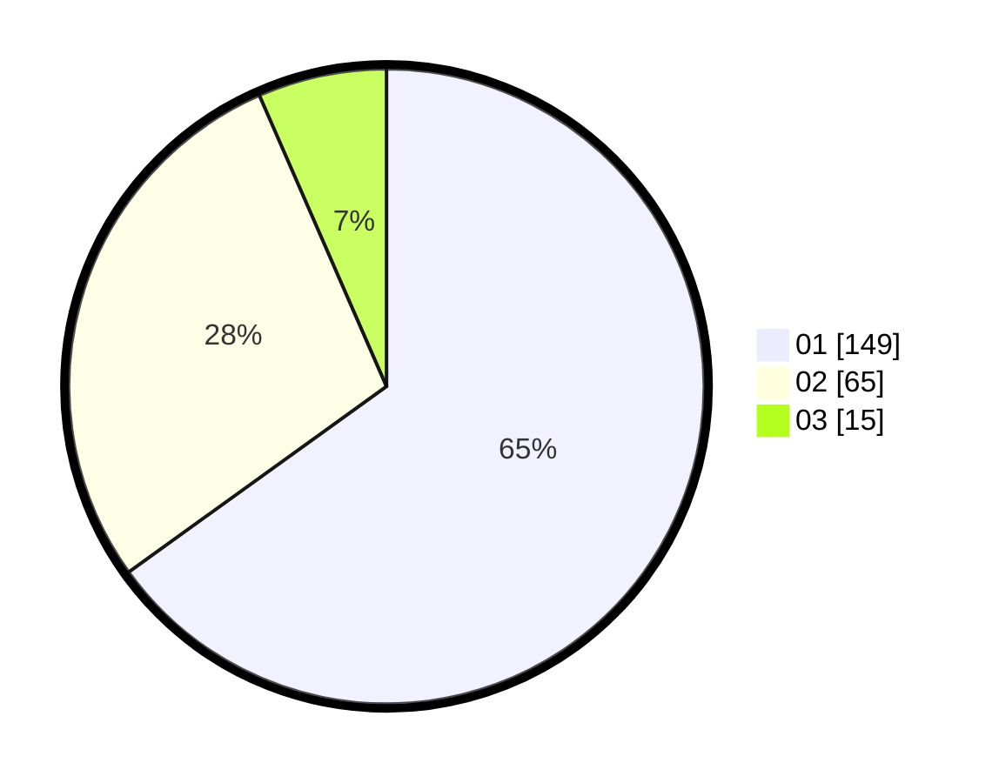

# Hasil

Hasil perolehan suara paslon dapat dilihat pada file paslon-01.txt, paslon-02.txt, dan paslon-03.txt.

Jika tidak ada, artinya data tersebut belum ada pada SIREKAP.

## Perolehan Suara

 * Paslon 01: **149**.
 * Paslon 02: **65**.
 * Paslon 03: **15**.

## Foto C Plano

https://sirekap-obj-formc.kpu.go.id/1d75/pemilu/ppwp/31/73/08/10/06/3173081006002-20240216-062359--fc5ef729-1e10-4de5-9a1a-a3b7b6abef09.jpg

https://sirekap-obj-formc.kpu.go.id/1d75/pemilu/ppwp/31/73/08/10/06/3173081006002-20240216-063142--ee9b11bb-abbb-43fb-8963-6bb503bec78e.jpg

https://sirekap-obj-formc.kpu.go.id/1d75/pemilu/ppwp/31/73/08/10/06/3173081006002-20240216-062400--5dbf67fa-84db-47fd-9835-32eb02bff906.jpg

## DATA PEMILIH TETAP

Jumlah pemilih dalam DPT: **284**.
 * L: **144**.
 * P: **140**.

## DATA PENGGUNA HAK PILIH

Jumlah pengguna hak pilih dalam DPT: **225**.
 * L: **110**.
 * P: **115**.

Jumlah pengguna hak pilih dalam DPTb: **2**.
 * L: **0**.
 * P: **2**.

Jumlah pengguna hak pilih dalam DPK: **3**.
 * L: **1**.
 * P: **2**.

Jumlah pengguna hak pilih: **230**.
 * L: **111**.
 * P: **119**.

## JUMLAH SUARA SAH DAN TIDAK SAH

JUMLAH SELURUH SUARA SAH: **229**.

JUMLAH SUARA TIDAK SAH: **1**.

JUMLAH SELURUH SUARA SAH DAN SUARA TIDAK SAH: **230**.
