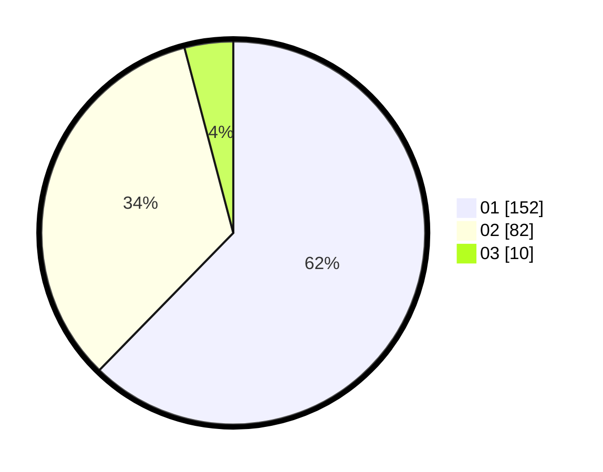

# Hasil

Hasil perolehan suara paslon dapat dilihat pada file paslon-01.txt, paslon-02.txt, dan paslon-03.txt.

Jika tidak ada, artinya data tersebut belum ada pada SIREKAP.

## Perolehan Suara

 * Paslon 01: **152**.
 * Paslon 02: **82**.
 * Paslon 03: **10**.

## Foto C Plano

https://sirekap-obj-formc.kpu.go.id/4989/pemilu/ppwp/31/73/08/10/06/3173081006003-20240216-113112--3272b5d9-a3a0-4433-95b8-688a1ff03182.jpg

https://sirekap-obj-formc.kpu.go.id/4989/pemilu/ppwp/31/73/08/10/06/3173081006003-20240216-113116--d9cdf82c-ecbf-41cd-b8e5-72d0aa4bdc99.jpg

https://sirekap-obj-formc.kpu.go.id/4989/pemilu/ppwp/31/73/08/10/06/3173081006003-20240216-113115--cda556a4-2baf-49a6-b733-7dd5ebae5c0e.jpg

## DATA PEMILIH TETAP

Jumlah pemilih dalam DPT: **287**.
 * L: **152**.
 * P: **135**.

## DATA PENGGUNA HAK PILIH

Jumlah pengguna hak pilih dalam DPT: **245**.
 * L: **124**.
 * P: **121**.

Jumlah pengguna hak pilih dalam DPTb: **1**.
 * L: **0**.
 * P: **1**.

Jumlah pengguna hak pilih dalam DPK: **0**.
 * L: **0**.
 * P: **0**.

Jumlah pengguna hak pilih: **246**.
 * L: **124**.
 * P: **122**.

## JUMLAH SUARA SAH DAN TIDAK SAH

JUMLAH SELURUH SUARA SAH: **244**.

JUMLAH SUARA TIDAK SAH: **3**.

JUMLAH SELURUH SUARA SAH DAN SUARA TIDAK SAH: **247**.
