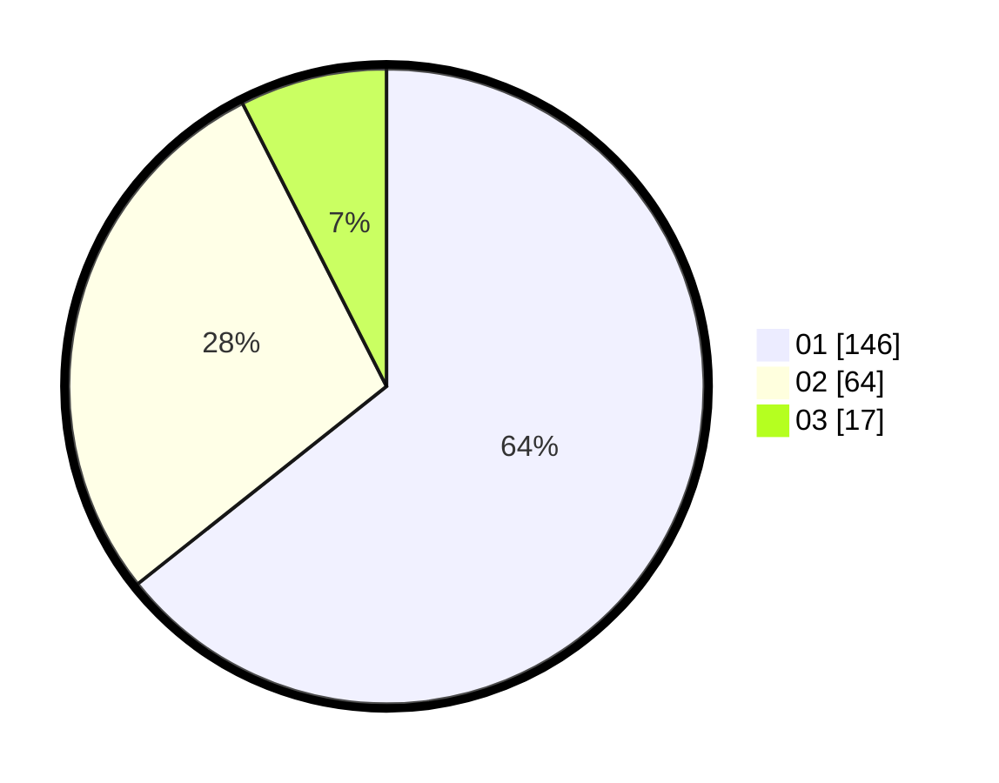

# Hasil

Hasil perolehan suara paslon dapat dilihat pada file paslon-01.txt, paslon-02.txt, dan paslon-03.txt.

Jika tidak ada, artinya data tersebut belum ada pada SIREKAP.

## Perolehan Suara

 * Paslon 01: **146**.
 * Paslon 02: **64**.
 * Paslon 03: **17**.

## Foto C Plano

https://sirekap-obj-formc.kpu.go.id/ee6a/pemilu/ppwp/31/73/08/10/06/3173081006013-20240214-233242--c2a3b7c8-f544-458e-beef-15d88701f523.jpg

https://sirekap-obj-formc.kpu.go.id/ee6a/pemilu/ppwp/31/73/08/10/06/3173081006013-20240214-160119--2cfdbd98-608e-405a-83e3-610bc6c35bbc.jpg

https://sirekap-obj-formc.kpu.go.id/ee6a/pemilu/ppwp/31/73/08/10/06/3173081006013-20240214-233254--af23545e-7035-4e01-9d0d-d522425533c3.jpg
