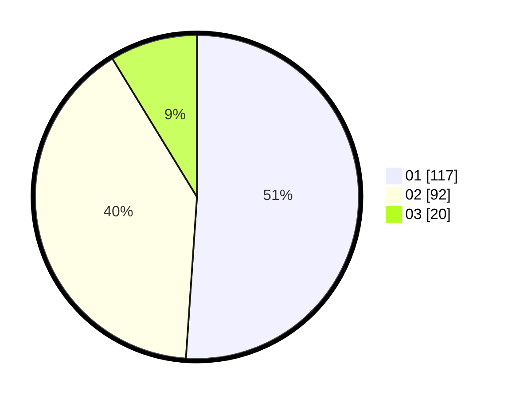

# Hasil

Hasil perolehan suara paslon dapat dilihat pada file paslon-01.txt, paslon-02.txt, dan paslon-03.txt.

Jika tidak ada, artinya data tersebut belum ada pada SIREKAP.

## Perolehan Suara

 * Paslon 01: **117**.
 * Paslon 02: **92**.
 * Paslon 03: **20**.

## Foto C Plano

https://sirekap-obj-formc.kpu.go.id/5ac0/pemilu/ppwp/31/73/08/10/06/3173081006014-20240216-163139--78f88aeb-4ac5-4df3-832b-a87af0b229f7.jpg

https://sirekap-obj-formc.kpu.go.id/5ac0/pemilu/ppwp/31/73/08/10/06/3173081006014-20240214-213615--0ff1f75c-0ef4-4025-a25f-9c6cc7673b80.jpg

https://sirekap-obj-formc.kpu.go.id/5ac0/pemilu/ppwp/31/73/08/10/06/3173081006014-20240214-213719--2a6c7e4a-c3c5-4367-9c7e-ff5e3671e8a6.jpg
