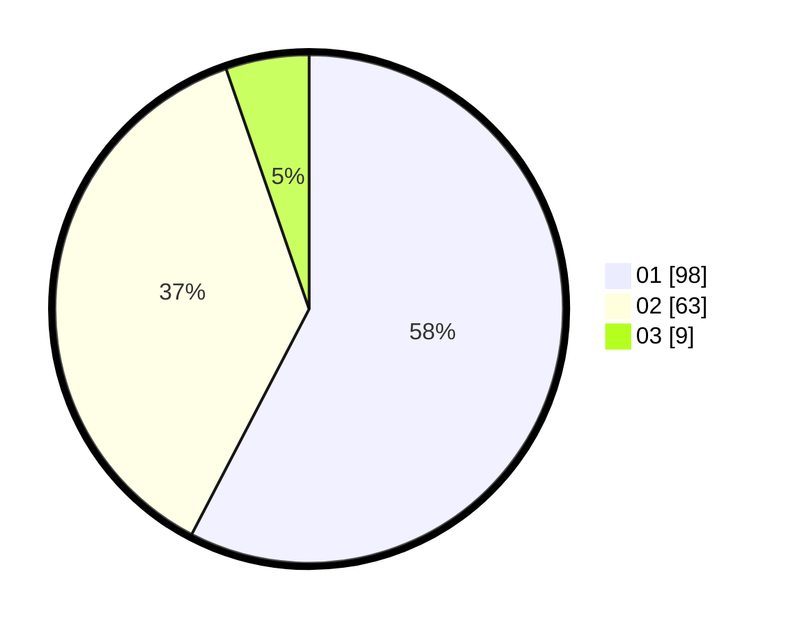

# Hasil

Hasil perolehan suara paslon dapat dilihat pada file paslon-01.txt, paslon-02.txt, dan paslon-03.txt.

Jika tidak ada, artinya data tersebut belum ada pada SIREKAP.

## Perolehan Suara

 * Paslon 01: **98**.
 * Paslon 02: **63**.
 * Paslon 03: **9**.

## Foto C Plano

https://sirekap-obj-formc.kpu.go.id/483e/pemilu/ppwp/31/73/08/10/06/3173081006023-20240214-205950--3b480cab-195d-4503-acb4-9be127851369.jpg

https://sirekap-obj-formc.kpu.go.id/483e/pemilu/ppwp/31/73/08/10/06/3173081006023-20240214-205719--a29950ec-c17e-4b7b-8be8-a02a24c9d2b6.jpg

https://sirekap-obj-formc.kpu.go.id/483e/pemilu/ppwp/31/73/08/10/06/3173081006023-20240214-210227--7da1cfe5-3146-4dc8-a10f-3457b7d01f88.jpg
