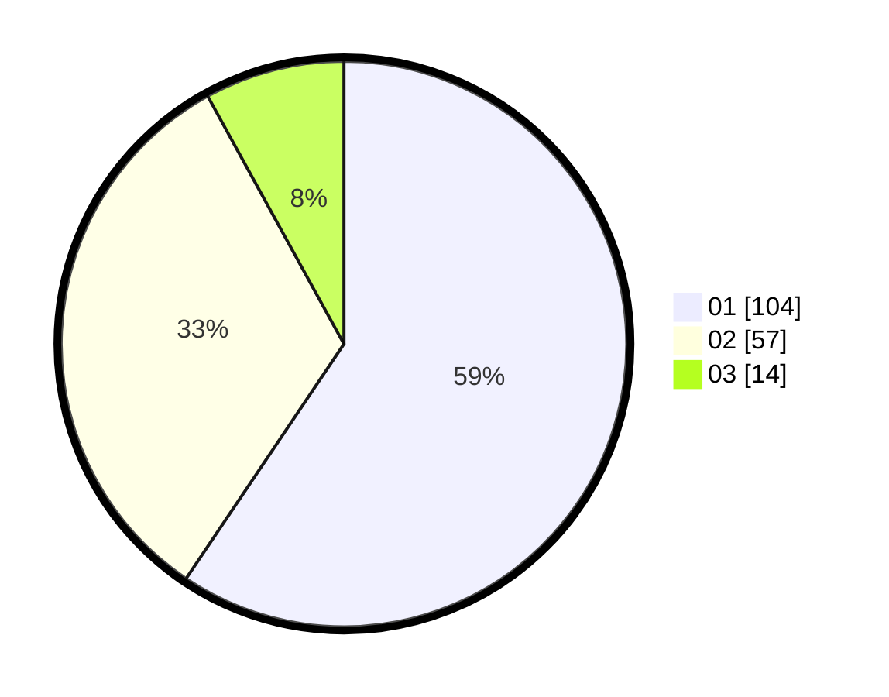

# Hasil

Hasil perolehan suara paslon dapat dilihat pada file paslon-01.txt, paslon-02.txt, dan paslon-03.txt.

Jika tidak ada, artinya data tersebut belum ada pada SIREKAP.

## Perolehan Suara

 * Paslon 01: **104**.
 * Paslon 02: **57**.
 * Paslon 03: **14**.

## Foto C Plano

https://sirekap-obj-formc.kpu.go.id/2a23/pemilu/ppwp/31/73/08/10/06/3173081006024-20240214-231549--af13c4c6-96b7-4390-9a44-74ebfa6b2281.jpg

https://sirekap-obj-formc.kpu.go.id/2a23/pemilu/ppwp/31/73/08/10/06/3173081006024-20240214-231624--66253a46-5785-4868-be57-b676b79f7a27.jpg

https://sirekap-obj-formc.kpu.go.id/2a23/pemilu/ppwp/31/73/08/10/06/3173081006024-20240214-231659--5ae0a759-8bd3-4150-8466-b326ae218529.jpg
