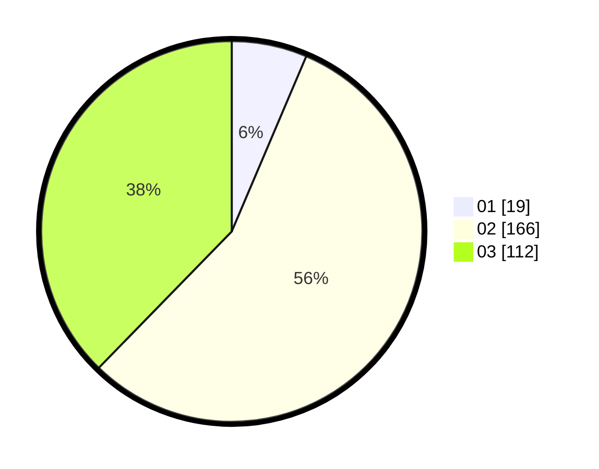

# Hasil

Hasil perolehan suara paslon dapat dilihat pada file paslon-01.txt, paslon-02.txt, dan paslon-03.txt.

Jika tidak ada, artinya data tersebut belum ada pada SIREKAP.

## Perolehan Suara

 * Paslon 01: **19**.
 * Paslon 02: **166**.
 * Paslon 03: **112**.

## Foto C Plano

https://sirekap-obj-formc.kpu.go.id/c7ce/pemilu/ppwp/31/73/08/10/06/3173081006026-20240214-201151--5242c39e-44e1-4856-b912-c182319aa2de.jpg

https://sirekap-obj-formc.kpu.go.id/c7ce/pemilu/ppwp/31/73/08/10/06/3173081006026-20240214-220451--9bc0271f-e844-44ee-b04e-70a41fa70208.jpg

https://sirekap-obj-formc.kpu.go.id/c7ce/pemilu/ppwp/31/73/08/10/06/3173081006026-20240214-201201--aef04c6d-ee26-4d05-b9be-e5c5728c9eb5.jpg

## DATA PEMILIH TETAP

Jumlah pemilih dalam DPT: **295**.
 * L: **131**.
 * P: **164**.

## DATA PENGGUNA HAK PILIH

Jumlah pengguna hak pilih dalam DPT: **220**.
 * L: **94**.
 * P: **126**.

Jumlah pengguna hak pilih dalam DPTb: **24**.
 * L: **10**.
 * P: **14**.

Jumlah pengguna hak pilih dalam DPK: **54**.
 * L: **25**.
 * P: **29**.

Jumlah pengguna hak pilih: **298**.
 * L: **129**.
 * P: **169**.

## JUMLAH SUARA SAH DAN TIDAK SAH

JUMLAH SELURUH SUARA SAH: **297**.

JUMLAH SUARA TIDAK SAH: **1**.

JUMLAH SELURUH SUARA SAH DAN SUARA TIDAK SAH: **298**.
