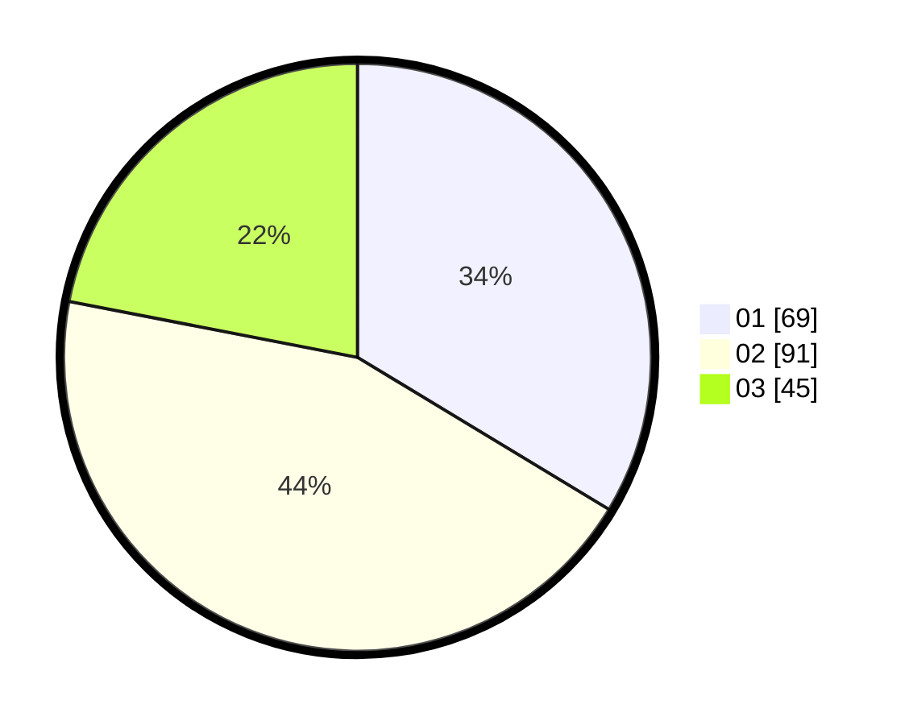

# Hasil

Hasil perolehan suara paslon dapat dilihat pada file paslon-01.txt, paslon-02.txt, dan paslon-03.txt.

Jika tidak ada, artinya data tersebut belum ada pada SIREKAP.

## Perolehan Suara

 * Paslon 01: **69**.
 * Paslon 02: **91**.
 * Paslon 03: **45**.

## Foto C Plano

https://sirekap-obj-formc.kpu.go.id/c69d/pemilu/ppwp/31/73/08/10/06/3173081006032-20240215-010816--c3c7c68d-353c-4bcd-8926-a6e99157411b.jpg

https://sirekap-obj-formc.kpu.go.id/c69d/pemilu/ppwp/31/73/08/10/06/3173081006032-20240215-010923--6fc80ff3-5532-4a9c-873b-f9055f13e00b.jpg

https://sirekap-obj-formc.kpu.go.id/c69d/pemilu/ppwp/31/73/08/10/06/3173081006032-20240215-011023--87f9cfd3-f635-48cc-b244-c563c6a4eb0d.jpg
