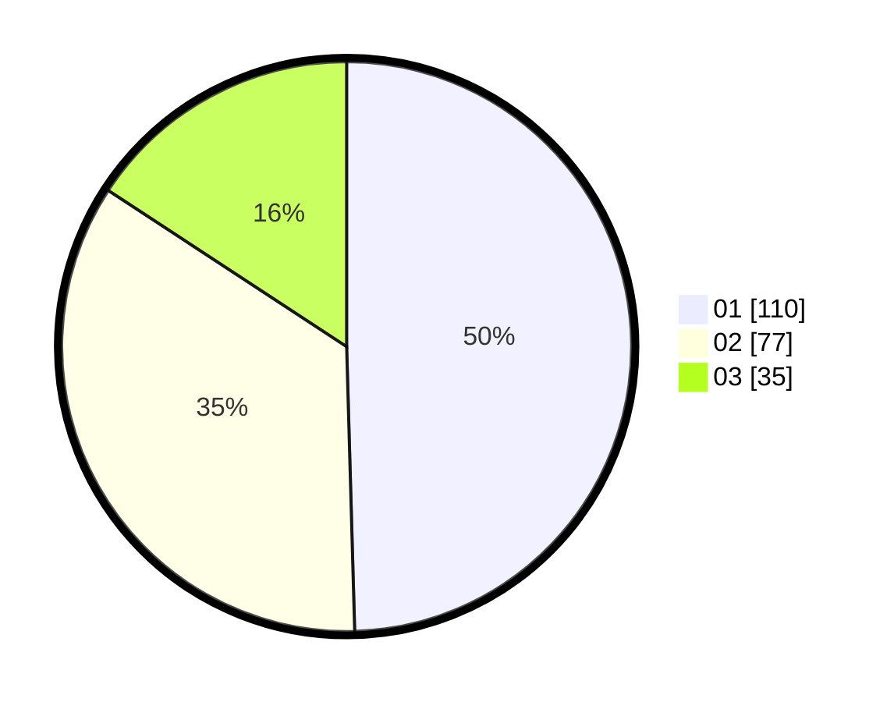

# Hasil

Hasil perolehan suara paslon dapat dilihat pada file paslon-01.txt, paslon-02.txt, dan paslon-03.txt.

Jika tidak ada, artinya data tersebut belum ada pada SIREKAP.

## Perolehan Suara

 * Paslon 01: **110**.
 * Paslon 02: **77**.
 * Paslon 03: **35**.

## Foto C Plano

https://sirekap-obj-formc.kpu.go.id/b200/pemilu/ppwp/31/73/08/10/06/3173081006034-20240214-155839--08b7b535-606f-4212-aabf-8870c2cd7902.jpg

https://sirekap-obj-formc.kpu.go.id/b200/pemilu/ppwp/31/73/08/10/06/3173081006034-20240214-191202--83221061-ace8-4cc2-ae8f-d260227e285a.jpg

https://sirekap-obj-formc.kpu.go.id/b200/pemilu/ppwp/31/73/08/10/06/3173081006034-20240214-185936--478994e0-fd21-4f7d-8d90-1039ef169f4f.jpg

## DATA PEMILIH TETAP

Jumlah pemilih dalam DPT: **291**.
 * L: **146**.
 * P: **145**.

## DATA PENGGUNA HAK PILIH

Jumlah pengguna hak pilih dalam DPT: **217**.
 * L: **109**.
 * P: **108**.

Jumlah pengguna hak pilih dalam DPTb: **7**.
 * L: **2**.
 * P: **5**.

Jumlah pengguna hak pilih dalam DPK: **3**.
 * L: **1**.
 * P: **2**.

Jumlah pengguna hak pilih: **227**.
 * L: **112**.
 * P: **115**.

## JUMLAH SUARA SAH DAN TIDAK SAH

JUMLAH SELURUH SUARA SAH: **222**.

JUMLAH SUARA TIDAK SAH: **5**.

JUMLAH SELURUH SUARA SAH DAN SUARA TIDAK SAH: **227**.
