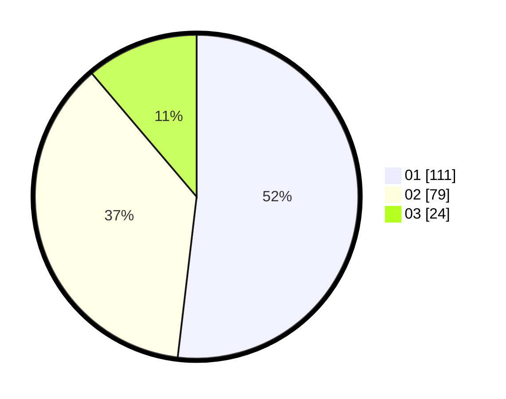

# Hasil

Hasil perolehan suara paslon dapat dilihat pada file paslon-01.txt, paslon-02.txt, dan paslon-03.txt.

Jika tidak ada, artinya data tersebut belum ada pada SIREKAP.

## Perolehan Suara

 * Paslon 01: **111**.
 * Paslon 02: **79**.
 * Paslon 03: **24**.

## Foto C Plano

https://sirekap-obj-formc.kpu.go.id/9918/pemilu/ppwp/31/73/08/10/06/3173081006046-20240214-191431--6b0a2eed-3669-4387-90b4-55ff5376282f.jpg

https://sirekap-obj-formc.kpu.go.id/9918/pemilu/ppwp/31/73/08/10/06/3173081006046-20240214-155157--7401a471-809e-4f47-a72f-de87bd94a84d.jpg

https://sirekap-obj-formc.kpu.go.id/9918/pemilu/ppwp/31/73/08/10/06/3173081006046-20240214-155312--13652a89-5b8b-4d39-ac9b-695e9aa279ef.jpg

## DATA PEMILIH TETAP

Jumlah pemilih dalam DPT: **285**.
 * L: **146**.
 * P: **139**.

## DATA PENGGUNA HAK PILIH

Jumlah pengguna hak pilih dalam DPT: **212**.
 * L: **109**.
 * P: **103**.

Jumlah pengguna hak pilih dalam DPTb: **1**.
 * L: **0**.
 * P: **1**.

Jumlah pengguna hak pilih dalam DPK: **3**.
 * L: **3**.
 * P: **0**.

Jumlah pengguna hak pilih: **216**.
 * L: **112**.
 * P: **104**.

## JUMLAH SUARA SAH DAN TIDAK SAH

JUMLAH SELURUH SUARA SAH: **214**.

JUMLAH SUARA TIDAK SAH: **2**.

JUMLAH SELURUH SUARA SAH DAN SUARA TIDAK SAH: **216**.
