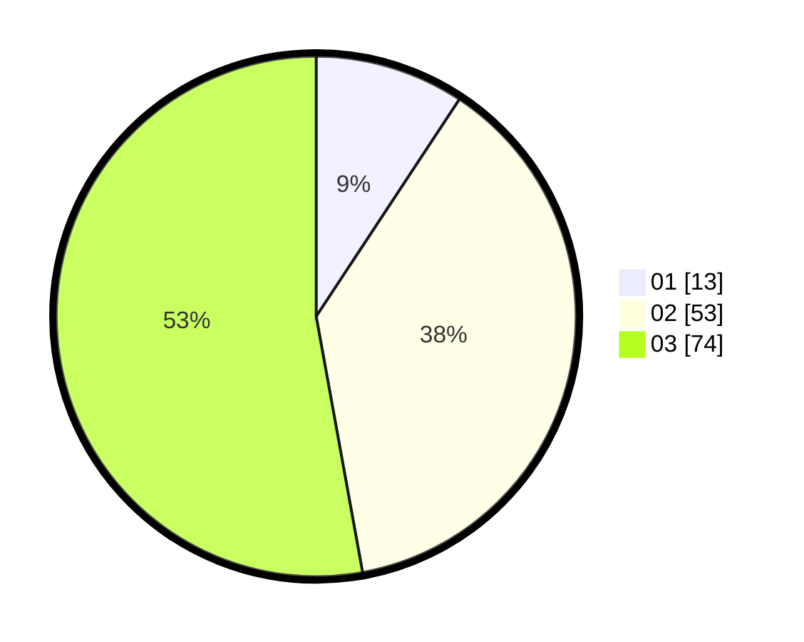

# Hasil

Hasil perolehan suara paslon dapat dilihat pada file paslon-01.txt, paslon-02.txt, dan paslon-03.txt.

Jika tidak ada, artinya data tersebut belum ada pada SIREKAP.

## Perolehan Suara

 * Paslon 01: **13**.
 * Paslon 02: **53**.
 * Paslon 03: **74**.

## Foto C Plano

https://sirekap-obj-formc.kpu.go.id/eaf4/pemilu/ppwp/31/73/08/10/06/3173081006053-20240214-212458--8477f9e3-764f-4957-92dc-64c07fd8b33c.jpg

https://sirekap-obj-formc.kpu.go.id/eaf4/pemilu/ppwp/31/73/08/10/06/3173081006053-20240214-212525--e821fb95-7ff7-41ca-bfd3-9e7574a33bee.jpg

https://sirekap-obj-formc.kpu.go.id/eaf4/pemilu/ppwp/31/73/08/10/06/3173081006053-20240214-212601--cba498e7-7bc3-4ba4-904f-52479da8f64d.jpg

## DATA PEMILIH TETAP

Jumlah pemilih dalam DPT: **176**.
 * L: **85**.
 * P: **91**.

## DATA PENGGUNA HAK PILIH

Jumlah pengguna hak pilih dalam DPT: **131**.
 * L: **63**.
 * P: **68**.

Jumlah pengguna hak pilih dalam DPTb: **8**.
 * L: **2**.
 * P: **6**.

Jumlah pengguna hak pilih dalam DPK: **2**.
 * L: **1**.
 * P: **1**.

Jumlah pengguna hak pilih: **141**.
 * L: **66**.
 * P: **75**.

## JUMLAH SUARA SAH DAN TIDAK SAH

JUMLAH SELURUH SUARA SAH: **140**.

JUMLAH SUARA TIDAK SAH: **1**.

JUMLAH SELURUH SUARA SAH DAN SUARA TIDAK SAH: **141**.
