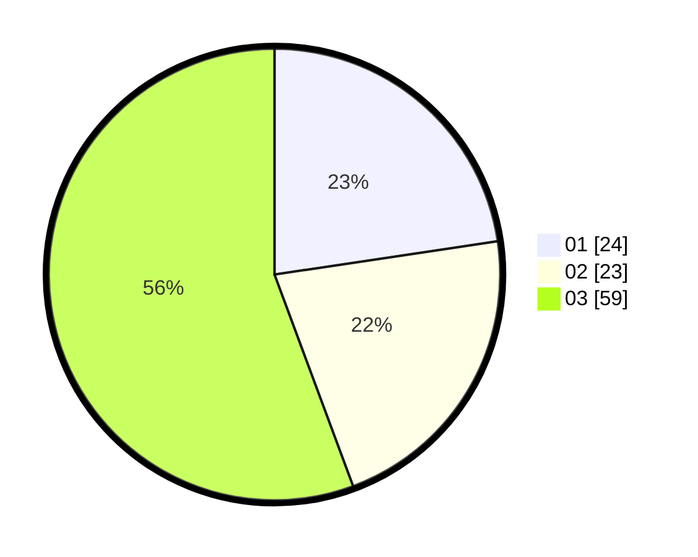

# Hasil

Hasil perolehan suara paslon dapat dilihat pada file paslon-01.txt, paslon-02.txt, dan paslon-03.txt.

Jika tidak ada, artinya data tersebut belum ada pada SIREKAP.

## Perolehan Suara

 * Paslon 01: **24**.
 * Paslon 02: **23**.
 * Paslon 03: **59**.

## Foto C Plano

https://sirekap-obj-formc.kpu.go.id/b260/pemilu/ppwp/31/73/08/10/06/3173081006062-20240214-203728--8ca66764-4dee-4321-a77b-b189090e933f.jpg

https://sirekap-obj-formc.kpu.go.id/b260/pemilu/ppwp/31/73/08/10/06/3173081006062-20240214-203808--5bc6f939-b626-49ca-9551-1261f9f8acb7.jpg

https://sirekap-obj-formc.kpu.go.id/b260/pemilu/ppwp/31/73/08/10/06/3173081006062-20240214-203812--18270b7f-28d1-44d1-aaa2-9d6d9b99a361.jpg
