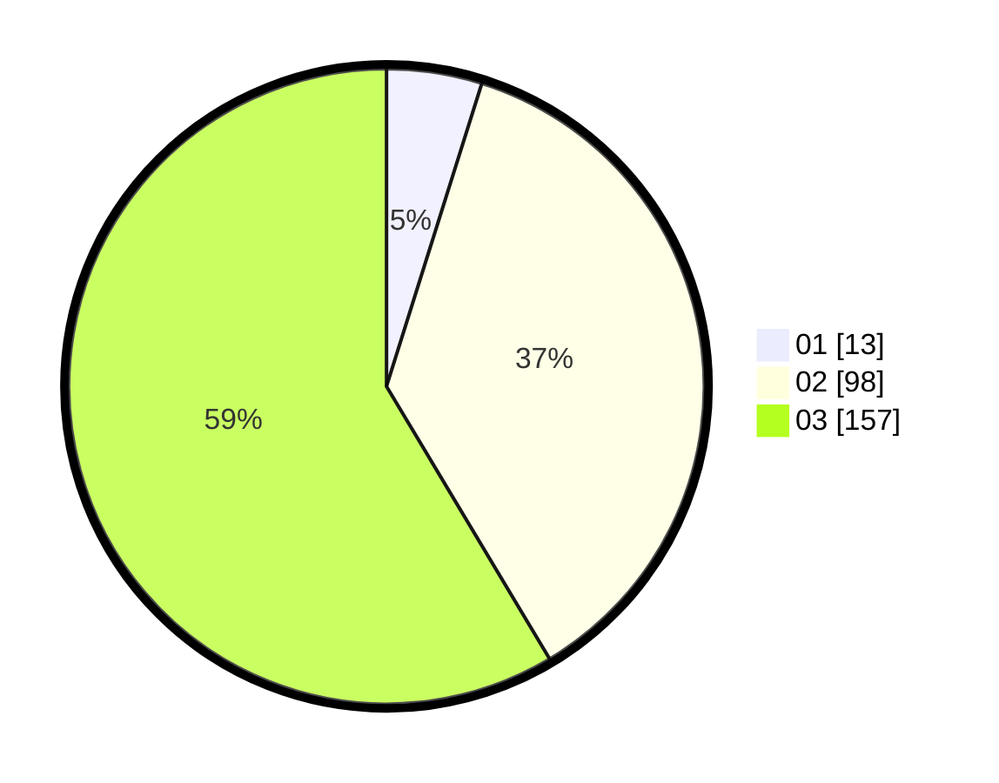

# Hasil

Hasil perolehan suara paslon dapat dilihat pada file paslon-01.txt, paslon-02.txt, dan paslon-03.txt.

Jika tidak ada, artinya data tersebut belum ada pada SIREKAP.

## Perolehan Suara

 * Paslon 01: **13**.
 * Paslon 02: **98**.
 * Paslon 03: **157**.

## Foto C Plano

https://sirekap-obj-formc.kpu.go.id/8eef/pemilu/ppwp/31/73/08/10/06/3173081006075-20240216-151556--2948c70e-495b-4c1b-8aca-38a7d794d63f.jpg

https://sirekap-obj-formc.kpu.go.id/8eef/pemilu/ppwp/31/73/08/10/06/3173081006075-20240218-162414--38a4709c-6bc9-4abf-8840-72be17595a74.jpg

https://sirekap-obj-formc.kpu.go.id/8eef/pemilu/ppwp/31/73/08/10/06/3173081006075-20240216-150308--effeab6f-e3bb-45ee-8cf5-1e580ce28bf5.jpg

## DATA PEMILIH TETAP

Jumlah pemilih dalam DPT: **299**.
 * L: **136**.
 * P: **163**.

## DATA PENGGUNA HAK PILIH

Jumlah pengguna hak pilih dalam DPT: **242**.
 * L: **111**.
 * P: **131**.

Jumlah pengguna hak pilih dalam DPTb: **20**.
 * L: **7**.
 * P: **13**.

Jumlah pengguna hak pilih dalam DPK: **6**.
 * L: **2**.
 * P: **4**.

Jumlah pengguna hak pilih: **268**.
 * L: **120**.
 * P: **148**.

## JUMLAH SUARA SAH DAN TIDAK SAH

JUMLAH SELURUH SUARA SAH: **268**.

JUMLAH SUARA TIDAK SAH: **0**.

JUMLAH SELURUH SUARA SAH DAN SUARA TIDAK SAH: **268**.
