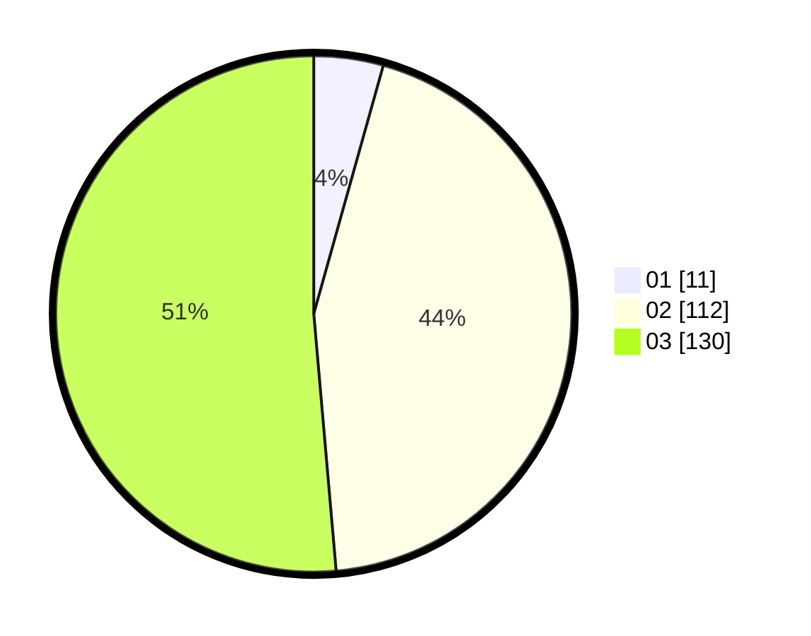

# Hasil

Hasil perolehan suara paslon dapat dilihat pada file paslon-01.txt, paslon-02.txt, dan paslon-03.txt.

Jika tidak ada, artinya data tersebut belum ada pada SIREKAP.

## Perolehan Suara

 * Paslon 01: **11**.
 * Paslon 02: **112**.
 * Paslon 03: **130**.

## Foto C Plano

https://sirekap-obj-formc.kpu.go.id/667d/pemilu/ppwp/31/73/08/10/06/3173081006076-20240214-223221--72a07606-8eb5-41c3-926c-40532792e5a6.jpg

https://sirekap-obj-formc.kpu.go.id/667d/pemilu/ppwp/31/73/08/10/06/3173081006076-20240214-223415--08d84140-9d34-402b-a098-e1e32d714f7f.jpg

https://sirekap-obj-formc.kpu.go.id/667d/pemilu/ppwp/31/73/08/10/06/3173081006076-20240214-223500--bc401a29-0c21-4ed0-8785-5fe1c20b1e32.jpg
