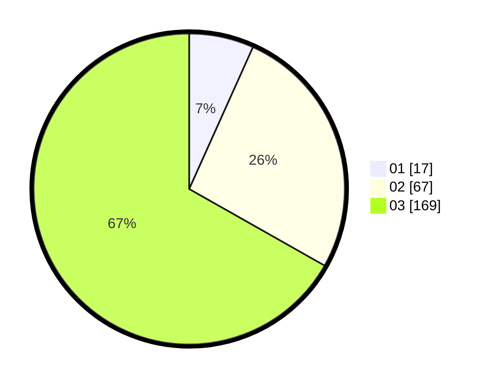

# Hasil

Hasil perolehan suara paslon dapat dilihat pada file paslon-01.txt, paslon-02.txt, dan paslon-03.txt.

Jika tidak ada, artinya data tersebut belum ada pada SIREKAP.

## Perolehan Suara

 * Paslon 01: **17**.
 * Paslon 02: **67**.
 * Paslon 03: **169**.

## Foto C Plano

https://sirekap-obj-formc.kpu.go.id/7e65/pemilu/ppwp/31/73/08/10/06/3173081006078-20240214-141648--aaa805c9-9cae-44be-8cb3-9daf745192d0.jpg

https://sirekap-obj-formc.kpu.go.id/7e65/pemilu/ppwp/31/73/08/10/06/3173081006078-20240214-141749--83373012-0155-4d82-8d89-c5c61a276a62.jpg

https://sirekap-obj-formc.kpu.go.id/7e65/pemilu/ppwp/31/73/08/10/06/3173081006078-20240214-141842--b3268043-6418-4180-909e-80360cd4a966.jpg
