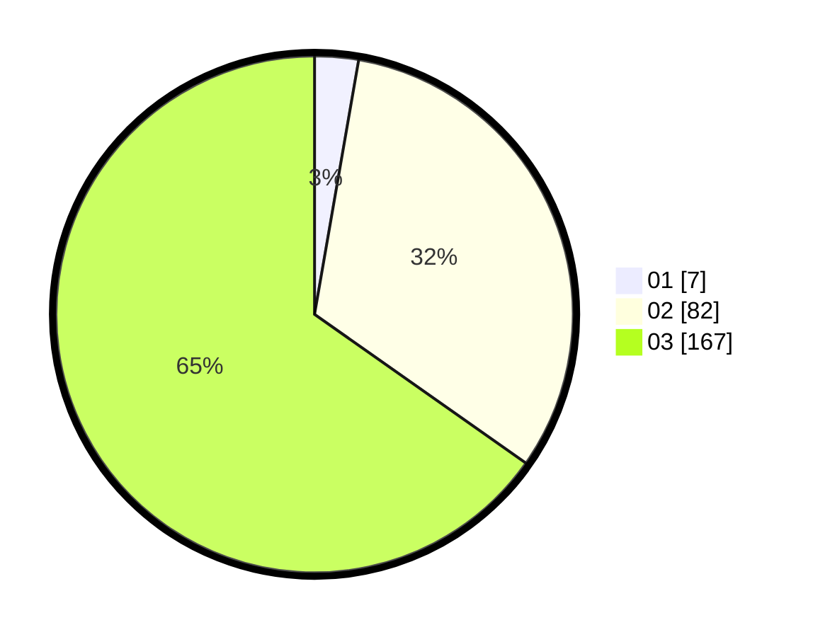

# Hasil

Hasil perolehan suara paslon dapat dilihat pada file paslon-01.txt, paslon-02.txt, dan paslon-03.txt.

Jika tidak ada, artinya data tersebut belum ada pada SIREKAP.

## Perolehan Suara

 * Paslon 01: **7**.
 * Paslon 02: **82**.
 * Paslon 03: **167**.

## Foto C Plano

https://sirekap-obj-formc.kpu.go.id/1219/pemilu/ppwp/31/73/08/10/06/3173081006080-20240214-155908--0ea65962-1847-4f9d-a710-38c0e52d7c5e.jpg

https://sirekap-obj-formc.kpu.go.id/1219/pemilu/ppwp/31/73/08/10/06/3173081006080-20240214-160058--b8fc535a-9d10-4649-ad58-979ef6b08d72.jpg

https://sirekap-obj-formc.kpu.go.id/1219/pemilu/ppwp/31/73/08/10/06/3173081006080-20240214-160136--ae281eff-cf24-4e80-9bc9-2bc94e4114d0.jpg
