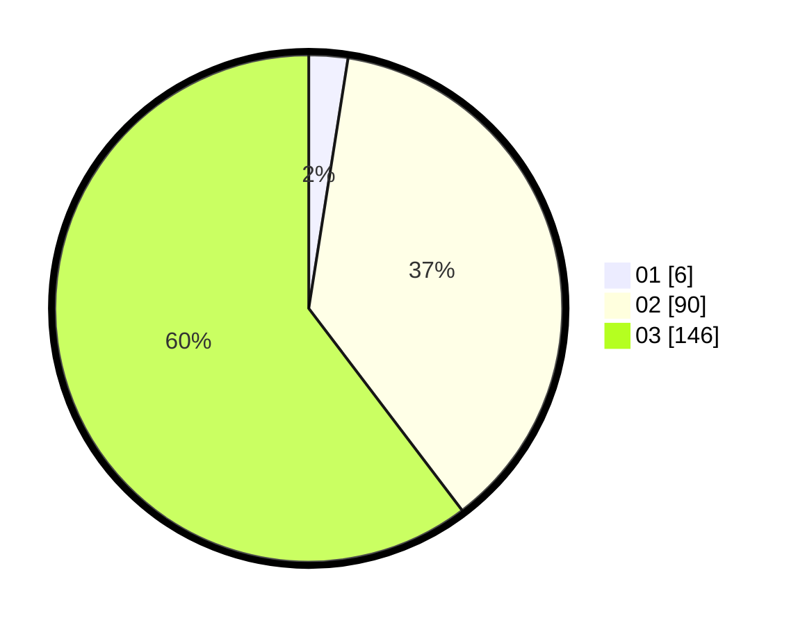

# Hasil

Hasil perolehan suara paslon dapat dilihat pada file paslon-01.txt, paslon-02.txt, dan paslon-03.txt.

Jika tidak ada, artinya data tersebut belum ada pada SIREKAP.

## Perolehan Suara

 * Paslon 01: **6**.
 * Paslon 02: **90**.
 * Paslon 03: **146**.

## Foto C Plano

https://sirekap-obj-formc.kpu.go.id/bcf1/pemilu/ppwp/31/73/08/10/06/3173081006083-20240215-141516--ffbecf44-966e-4f22-8e9d-347bcbe0fee5.jpg

https://sirekap-obj-formc.kpu.go.id/bcf1/pemilu/ppwp/31/73/08/10/06/3173081006083-20240215-152140--0d5b4624-f73b-4ae6-90ac-c6c045f8f11b.jpg

https://sirekap-obj-formc.kpu.go.id/bcf1/pemilu/ppwp/31/73/08/10/06/3173081006083-20240215-155657--4ebbd0bc-ad82-42d5-b660-6b95e9385817.jpg
