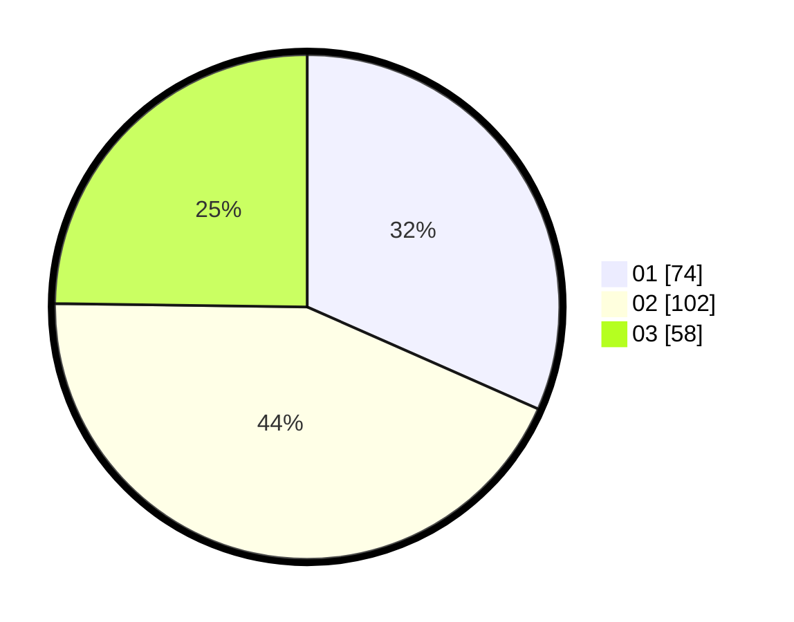

# Hasil

Hasil perolehan suara paslon dapat dilihat pada file paslon-01.txt, paslon-02.txt, dan paslon-03.txt.

Jika tidak ada, artinya data tersebut belum ada pada SIREKAP.

## Perolehan Suara

 * Paslon 01: **74**.
 * Paslon 02: **102**.
 * Paslon 03: **58**.

## Foto C Plano

https://sirekap-obj-formc.kpu.go.id/2141/pemilu/ppwp/31/73/08/10/06/3173081006084-20240215-110607--6b45273f-5330-41ff-8409-9590e567bfbf.jpg

https://sirekap-obj-formc.kpu.go.id/2141/pemilu/ppwp/31/73/08/10/06/3173081006084-20240215-103349--2de9ea8d-5e3e-4e0f-8115-59a2a93142e0.jpg

https://sirekap-obj-formc.kpu.go.id/2141/pemilu/ppwp/31/73/08/10/06/3173081006084-20240215-103709--3a95b228-42ab-4e33-b81f-75c50b9883f3.jpg
