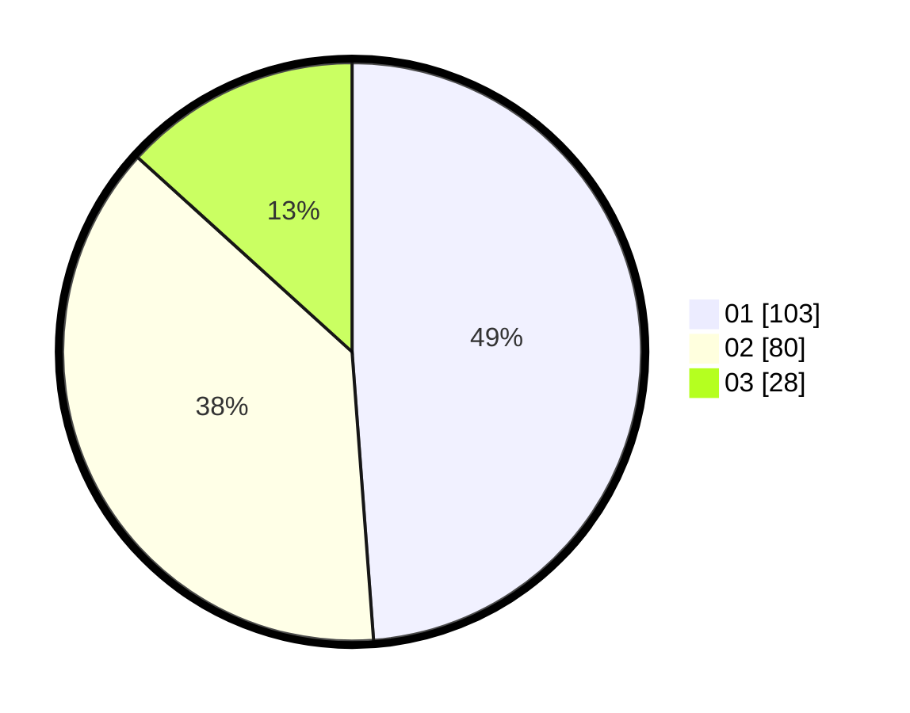

# Hasil

Hasil perolehan suara paslon dapat dilihat pada file paslon-01.txt, paslon-02.txt, dan paslon-03.txt.

Jika tidak ada, artinya data tersebut belum ada pada SIREKAP.

## Perolehan Suara

 * Paslon 01: **103**.
 * Paslon 02: **80**.
 * Paslon 03: **28**.

## Foto C Plano

https://sirekap-obj-formc.kpu.go.id/9f39/pemilu/ppwp/31/73/08/10/06/3173081006091-20240215-001405--0a5cf0bf-834d-475c-8c09-c5e4764a4858.jpg

https://sirekap-obj-formc.kpu.go.id/9f39/pemilu/ppwp/31/73/08/10/06/3173081006091-20240215-001502--b3d9bd2e-9336-44f2-a68a-7bd672022756.jpg

https://sirekap-obj-formc.kpu.go.id/9f39/pemilu/ppwp/31/73/08/10/06/3173081006091-20240215-002129--81fc2d66-68a0-4876-ae06-62336afc46f9.jpg
