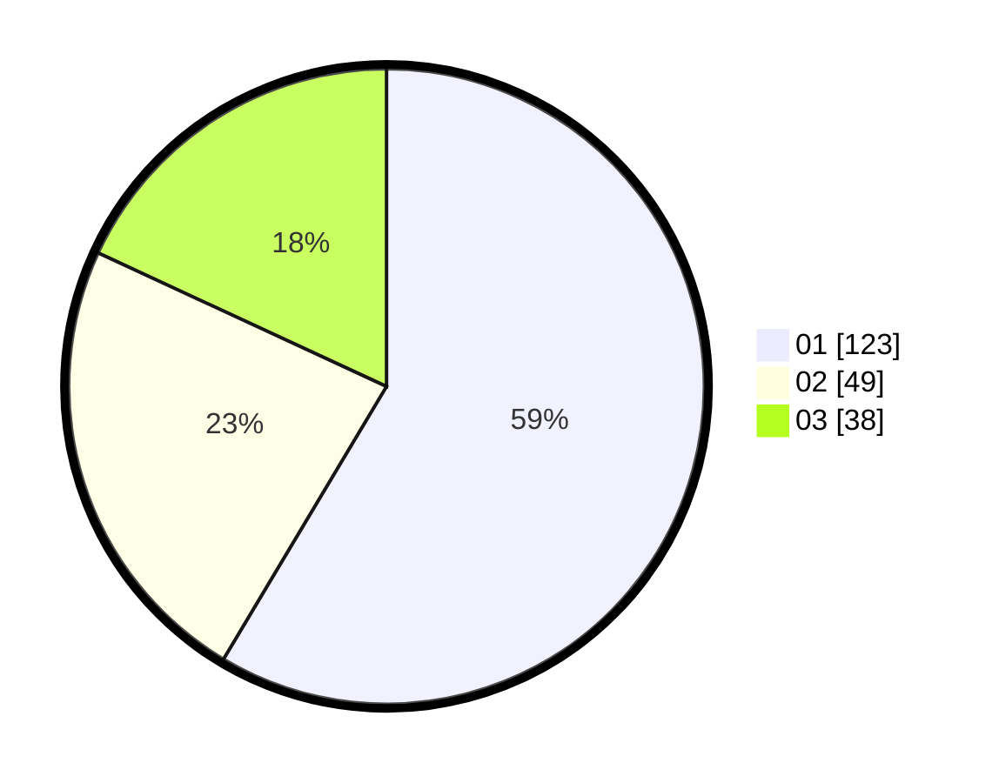

# Hasil

Hasil perolehan suara paslon dapat dilihat pada file paslon-01.txt, paslon-02.txt, dan paslon-03.txt.

Jika tidak ada, artinya data tersebut belum ada pada SIREKAP.

## Perolehan Suara

 * Paslon 01: **123**.
 * Paslon 02: **49**.
 * Paslon 03: **38**.

## Foto C Plano

https://sirekap-obj-formc.kpu.go.id/2213/pemilu/ppwp/31/74/01/10/01/3174011001003-20240215-103357--e5955a3b-0b55-4eaf-b4ab-ba0b31f3af04.jpg

https://sirekap-obj-formc.kpu.go.id/2213/pemilu/ppwp/31/74/01/10/01/3174011001003-20240215-103422--5dce3fbb-9fa2-45bd-b058-3b4005a1ee68.jpg

https://sirekap-obj-formc.kpu.go.id/2213/pemilu/ppwp/31/74/01/10/01/3174011001003-20240215-103411--1e478404-4641-461b-8c4c-a3ec3ca92cdc.jpg

## DATA PEMILIH TETAP

Jumlah pemilih dalam DPT: **246**.
 * L: **111**.
 * P: **135**.

## DATA PENGGUNA HAK PILIH

Jumlah pengguna hak pilih dalam DPT: **199**.
 * L: **88**.
 * P: **111**.

Jumlah pengguna hak pilih dalam DPTb: **15**.
 * L: **4**.
 * P: **11**.

Jumlah pengguna hak pilih dalam DPK: **2**.
 * L: **0**.
 * P: **2**.

Jumlah pengguna hak pilih: **216**.
 * L: **92**.
 * P: **124**.

## JUMLAH SUARA SAH DAN TIDAK SAH

JUMLAH SELURUH SUARA SAH: **210**.

JUMLAH SUARA TIDAK SAH: **6**.

JUMLAH SELURUH SUARA SAH DAN SUARA TIDAK SAH: **216**.
