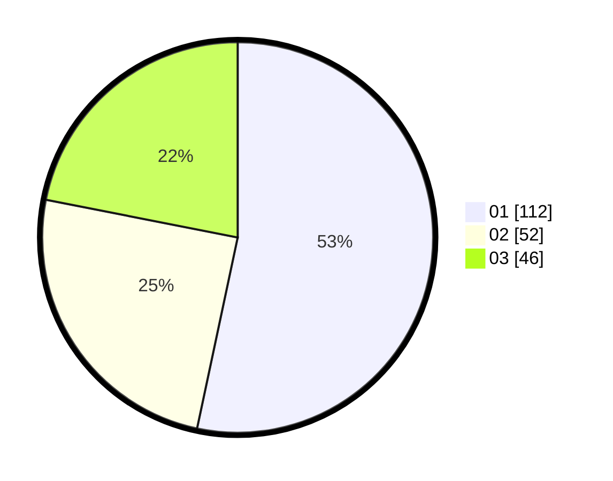

# Hasil

Hasil perolehan suara paslon dapat dilihat pada file paslon-01.txt, paslon-02.txt, dan paslon-03.txt.

Jika tidak ada, artinya data tersebut belum ada pada SIREKAP.

## Perolehan Suara

 * Paslon 01: **112**.
 * Paslon 02: **52**.
 * Paslon 03: **46**.

## Foto C Plano

https://sirekap-obj-formc.kpu.go.id/04c1/pemilu/ppwp/31/74/01/10/01/3174011001015-20240214-184441--cff8536c-bc3b-4567-bcad-66f4051ce3d3.jpg

https://sirekap-obj-formc.kpu.go.id/04c1/pemilu/ppwp/31/74/01/10/01/3174011001015-20240215-234150--e27fe0c9-8901-4d6b-bf8a-c2e0d2a9b605.jpg

https://sirekap-obj-formc.kpu.go.id/04c1/pemilu/ppwp/31/74/01/10/01/3174011001015-20240214-192933--e5a620fb-a95c-4296-b06b-f70e5a8dd456.jpg

## DATA PEMILIH TETAP

Jumlah pemilih dalam DPT: **257**.
 * L: **115**.
 * P: **142**.

## DATA PENGGUNA HAK PILIH

Jumlah pengguna hak pilih dalam DPT: **210**.
 * L: **95**.
 * P: **115**.

Jumlah pengguna hak pilih dalam DPTb: **8**.
 * L: **2**.
 * P: **6**.

Jumlah pengguna hak pilih dalam DPK: **1**.
 * L: **0**.
 * P: **1**.

Jumlah pengguna hak pilih: **219**.
 * L: **97**.
 * P: **122**.

## JUMLAH SUARA SAH DAN TIDAK SAH

JUMLAH SELURUH SUARA SAH: **210**.

JUMLAH SUARA TIDAK SAH: **9**.

JUMLAH SELURUH SUARA SAH DAN SUARA TIDAK SAH: **219**.
