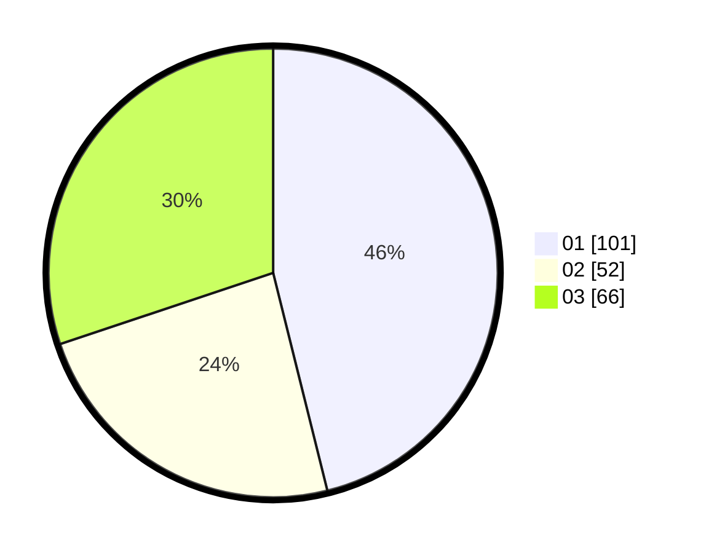

# Hasil

Hasil perolehan suara paslon dapat dilihat pada file paslon-01.txt, paslon-02.txt, dan paslon-03.txt.

Jika tidak ada, artinya data tersebut belum ada pada SIREKAP.

## Perolehan Suara

 * Paslon 01: **101**.
 * Paslon 02: **52**.
 * Paslon 03: **66**.

## Foto C Plano

https://sirekap-obj-formc.kpu.go.id/7477/pemilu/ppwp/31/74/01/10/01/3174011001031-20240216-065604--bec959f6-f54c-44c2-b987-d029e35d7e5c.jpg

https://sirekap-obj-formc.kpu.go.id/7477/pemilu/ppwp/31/74/01/10/01/3174011001031-20240216-065616--e888b438-c27c-4505-ac09-de9a71a81384.jpg

https://sirekap-obj-formc.kpu.go.id/7477/pemilu/ppwp/31/74/01/10/01/3174011001031-20240216-065612--e885cd82-33ea-45ff-9f7f-b29eb55824ff.jpg

## DATA PEMILIH TETAP

Jumlah pemilih dalam DPT: **245**.
 * L: **109**.
 * P: **136**.

## DATA PENGGUNA HAK PILIH

Jumlah pengguna hak pilih dalam DPT: **203**.
 * L: **90**.
 * P: **113**.

Jumlah pengguna hak pilih dalam DPTb: **20**.
 * L: **5**.
 * P: **15**.

Jumlah pengguna hak pilih dalam DPK: **0**.
 * L: **0**.
 * P: **0**.

Jumlah pengguna hak pilih: **223**.
 * L: **95**.
 * P: **128**.

## JUMLAH SUARA SAH DAN TIDAK SAH

JUMLAH SELURUH SUARA SAH: **219**.

JUMLAH SUARA TIDAK SAH: **4**.

JUMLAH SELURUH SUARA SAH DAN SUARA TIDAK SAH: **223**.
