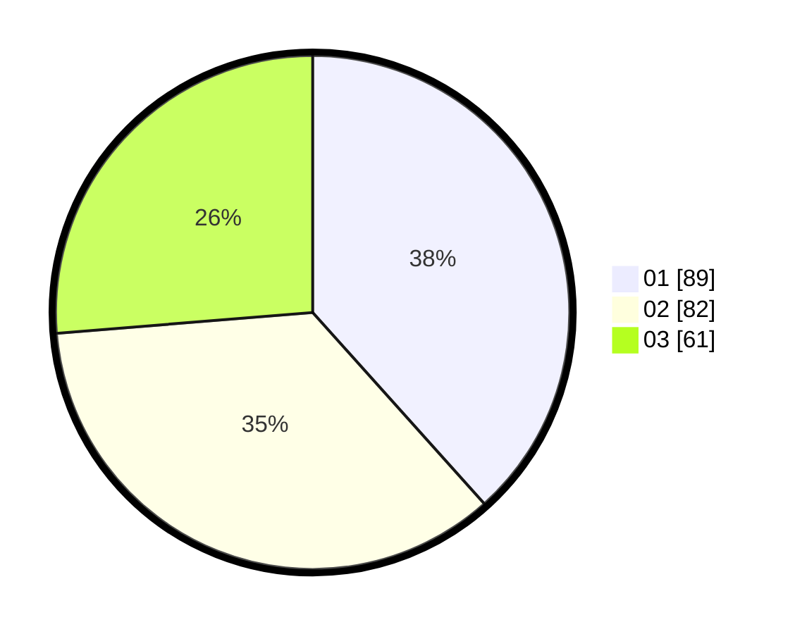

# Hasil

Hasil perolehan suara paslon dapat dilihat pada file paslon-01.txt, paslon-02.txt, dan paslon-03.txt.

Jika tidak ada, artinya data tersebut belum ada pada SIREKAP.

## Perolehan Suara

 * Paslon 01: **89**.
 * Paslon 02: **82**.
 * Paslon 03: **61**.

## Foto C Plano

https://sirekap-obj-formc.kpu.go.id/4f69/pemilu/ppwp/31/74/01/10/01/3174011001034-20240217-162145--35f99f23-d96d-4527-9c1a-42fc43effaa3.jpg

https://sirekap-obj-formc.kpu.go.id/4f69/pemilu/ppwp/31/74/01/10/01/3174011001034-20240217-162153--364564ff-ce9a-4c64-9319-aa55a12cc945.jpg

https://sirekap-obj-formc.kpu.go.id/4f69/pemilu/ppwp/31/74/01/10/01/3174011001034-20240217-162200--81109156-a0d0-4f29-b53d-193c6fd031d2.jpg

## DATA PEMILIH TETAP

Jumlah pemilih dalam DPT: **233**.
 * L: **112**.
 * P: **121**.

## DATA PENGGUNA HAK PILIH

Jumlah pengguna hak pilih dalam DPT: **233**.
 * L: **112**.
 * P: **121**.

Jumlah pengguna hak pilih dalam DPTb: **2**.
 * L: **2**.
 * P: **0**.

Jumlah pengguna hak pilih dalam DPK: **1**.
 * L: **0**.
 * P: **1**.

Jumlah pengguna hak pilih: **236**.
 * L: **114**.
 * P: **122**.

## JUMLAH SUARA SAH DAN TIDAK SAH

JUMLAH SELURUH SUARA SAH: **232**.

JUMLAH SUARA TIDAK SAH: **4**.

JUMLAH SELURUH SUARA SAH DAN SUARA TIDAK SAH: **236**.
