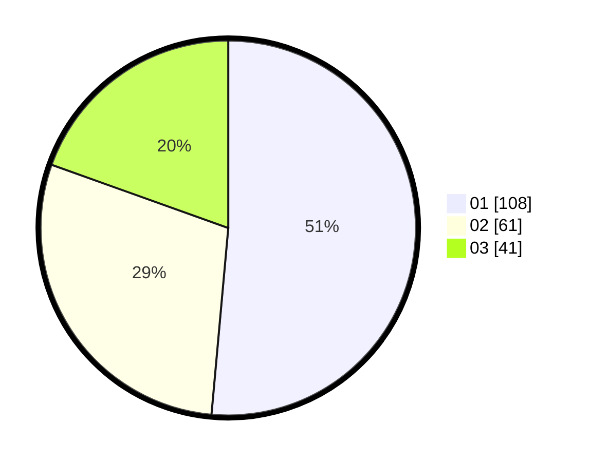

# Hasil

Hasil perolehan suara paslon dapat dilihat pada file paslon-01.txt, paslon-02.txt, dan paslon-03.txt.

Jika tidak ada, artinya data tersebut belum ada pada SIREKAP.

## Perolehan Suara

 * Paslon 01: **108**.
 * Paslon 02: **61**.
 * Paslon 03: **41**.

## Foto C Plano

https://sirekap-obj-formc.kpu.go.id/334f/pemilu/ppwp/31/74/01/10/01/3174011001042-20240214-204348--80f0c5a6-8b48-4891-81dc-c61666860c30.jpg

https://sirekap-obj-formc.kpu.go.id/334f/pemilu/ppwp/31/74/01/10/01/3174011001042-20240214-204619--4fb5ef56-c5c6-4411-a69c-a377b960677a.jpg

https://sirekap-obj-formc.kpu.go.id/334f/pemilu/ppwp/31/74/01/10/01/3174011001042-20240214-204729--50551db5-e051-48e6-93e3-fb57a8bbf931.jpg

## DATA PEMILIH TETAP

Jumlah pemilih dalam DPT: **241**.
 * L: **115**.
 * P: **126**.

## DATA PENGGUNA HAK PILIH

Jumlah pengguna hak pilih dalam DPT: **204**.
 * L: **101**.
 * P: **103**.

Jumlah pengguna hak pilih dalam DPTb: **8**.
 * L: **1**.
 * P: **7**.

Jumlah pengguna hak pilih dalam DPK: **2**.
 * L: **1**.
 * P: **1**.

Jumlah pengguna hak pilih: **214**.
 * L: **103**.
 * P: **111**.

## JUMLAH SUARA SAH DAN TIDAK SAH

JUMLAH SELURUH SUARA SAH: **210**.

JUMLAH SUARA TIDAK SAH: **4**.

JUMLAH SELURUH SUARA SAH DAN SUARA TIDAK SAH: **214**.
