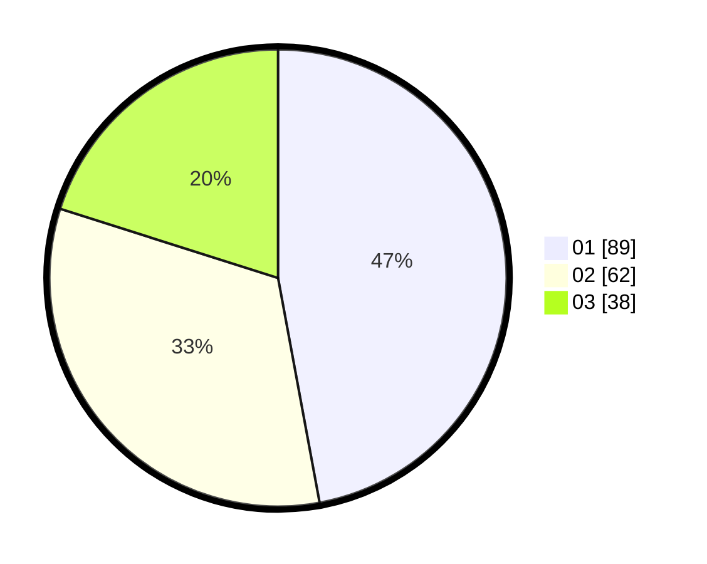

# Hasil

Hasil perolehan suara paslon dapat dilihat pada file paslon-01.txt, paslon-02.txt, dan paslon-03.txt.

Jika tidak ada, artinya data tersebut belum ada pada SIREKAP.

## Perolehan Suara

 * Paslon 01: **89**.
 * Paslon 02: **62**.
 * Paslon 03: **38**.

## Foto C Plano

https://sirekap-obj-formc.kpu.go.id/9a7a/pemilu/ppwp/31/74/01/10/01/3174011001043-20240215-054622--d181ba12-9a9c-4a81-82c1-1780d8a8fd93.jpg

https://sirekap-obj-formc.kpu.go.id/9a7a/pemilu/ppwp/31/74/01/10/01/3174011001043-20240216-151325--08c8d16b-d229-43ea-9ce4-6f4173ab54bd.jpg

https://sirekap-obj-formc.kpu.go.id/9a7a/pemilu/ppwp/31/74/01/10/01/3174011001043-20240216-151324--618ede63-3275-49ba-a5be-3d41b1ae9088.jpg

## DATA PEMILIH TETAP

Jumlah pemilih dalam DPT: **219**.
 * L: **89**.
 * P: **130**.

## DATA PENGGUNA HAK PILIH

Jumlah pengguna hak pilih dalam DPT: **179**.
 * L: **70**.
 * P: **109**.

Jumlah pengguna hak pilih dalam DPTb: **7**.
 * L: **2**.
 * P: **5**.

Jumlah pengguna hak pilih dalam DPK: **8**.
 * L: **4**.
 * P: **4**.

Jumlah pengguna hak pilih: **194**.
 * L: **76**.
 * P: **118**.

## JUMLAH SUARA SAH DAN TIDAK SAH

JUMLAH SELURUH SUARA SAH: **189**.

JUMLAH SUARA TIDAK SAH: **5**.

JUMLAH SELURUH SUARA SAH DAN SUARA TIDAK SAH: **194**.
