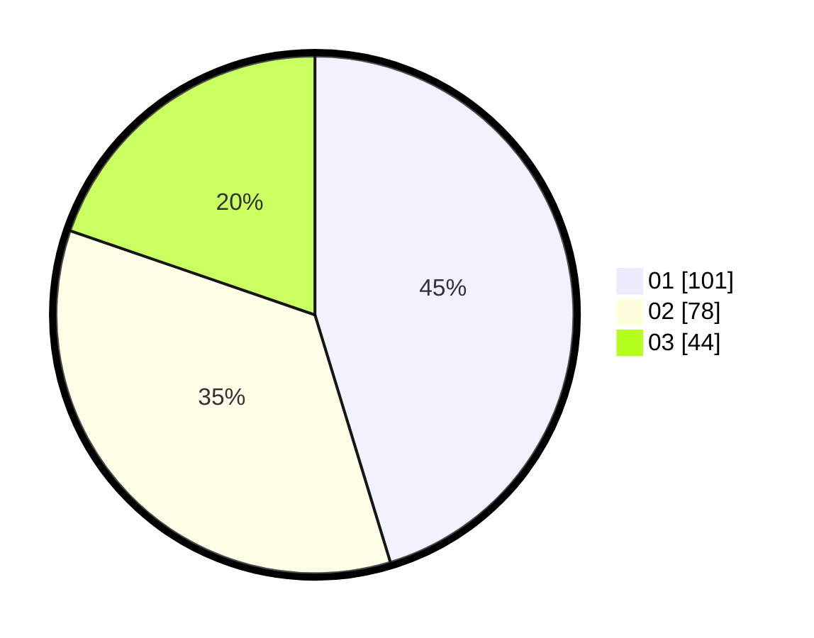

# Hasil

Hasil perolehan suara paslon dapat dilihat pada file paslon-01.txt, paslon-02.txt, dan paslon-03.txt.

Jika tidak ada, artinya data tersebut belum ada pada SIREKAP.

## Perolehan Suara

 * Paslon 01: **101**.
 * Paslon 02: **78**.
 * Paslon 03: **44**.

## Foto C Plano

https://sirekap-obj-formc.kpu.go.id/fc27/pemilu/ppwp/31/74/01/10/01/3174011001047-20240214-185314--27ebd81c-9d6a-40ce-9f5a-9e3fb6b245f0.jpg

https://sirekap-obj-formc.kpu.go.id/fc27/pemilu/ppwp/31/74/01/10/01/3174011001047-20240214-192617--bcf763bb-0b8e-4bb9-9db6-0c8038ff6209.jpg

https://sirekap-obj-formc.kpu.go.id/fc27/pemilu/ppwp/31/74/01/10/01/3174011001047-20240214-192754--c52f0986-fa01-4c1e-a5d0-f687c94d3525.jpg

## DATA PEMILIH TETAP

Jumlah pemilih dalam DPT: **267**.
 * L: **126**.
 * P: **141**.

## DATA PENGGUNA HAK PILIH

Jumlah pengguna hak pilih dalam DPT: **214**.
 * L: **100**.
 * P: **114**.

Jumlah pengguna hak pilih dalam DPTb: **10**.
 * L: **3**.
 * P: **7**.

Jumlah pengguna hak pilih dalam DPK: **5**.
 * L: **2**.
 * P: **3**.

Jumlah pengguna hak pilih: **229**.
 * L: **105**.
 * P: **124**.

## JUMLAH SUARA SAH DAN TIDAK SAH

JUMLAH SELURUH SUARA SAH: **223**.

JUMLAH SUARA TIDAK SAH: **6**.

JUMLAH SELURUH SUARA SAH DAN SUARA TIDAK SAH: **229**.
