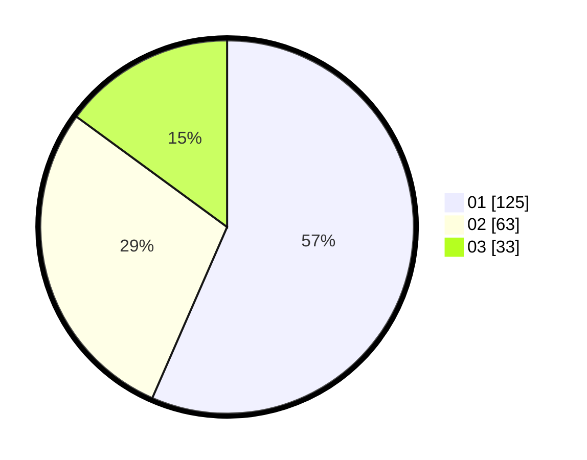

# Hasil

Hasil perolehan suara paslon dapat dilihat pada file paslon-01.txt, paslon-02.txt, dan paslon-03.txt.

Jika tidak ada, artinya data tersebut belum ada pada SIREKAP.

## Perolehan Suara

 * Paslon 01: **125**.
 * Paslon 02: **63**.
 * Paslon 03: **33**.

## Foto C Plano

https://sirekap-obj-formc.kpu.go.id/259c/pemilu/ppwp/31/74/01/10/01/3174011001048-20240214-231621--f4c61a5b-a91e-45c0-8057-8cb88aab8d87.jpg

https://sirekap-obj-formc.kpu.go.id/259c/pemilu/ppwp/31/74/01/10/01/3174011001048-20240214-225636--dc784e1f-bbe1-4cc6-b7a4-824f2708ef96.jpg

https://sirekap-obj-formc.kpu.go.id/259c/pemilu/ppwp/31/74/01/10/01/3174011001048-20240214-225729--2d4f60b3-5b31-43ae-b616-c6c0b6df7f01.jpg

## DATA PEMILIH TETAP

Jumlah pemilih dalam DPT: **257**.
 * L: **128**.
 * P: **127**.

## DATA PENGGUNA HAK PILIH

Jumlah pengguna hak pilih dalam DPT: **209**.
 * L: **99**.
 * P: **110**.

Jumlah pengguna hak pilih dalam DPTb: **13**.
 * L: **5**.
 * P: **8**.

Jumlah pengguna hak pilih dalam DPK: **4**.
 * L: **2**.
 * P: **2**.

Jumlah pengguna hak pilih: **226**.
 * L: **106**.
 * P: **120**.

## JUMLAH SUARA SAH DAN TIDAK SAH

JUMLAH SELURUH SUARA SAH: **221**.

JUMLAH SUARA TIDAK SAH: **5**.

JUMLAH SELURUH SUARA SAH DAN SUARA TIDAK SAH: **226**.
