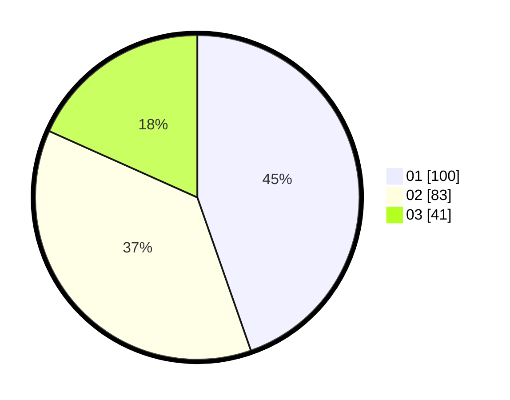

# Hasil

Hasil perolehan suara paslon dapat dilihat pada file paslon-01.txt, paslon-02.txt, dan paslon-03.txt.

Jika tidak ada, artinya data tersebut belum ada pada SIREKAP.

## Perolehan Suara

 * Paslon 01: **100**.
 * Paslon 02: **83**.
 * Paslon 03: **41**.

## Foto C Plano

https://sirekap-obj-formc.kpu.go.id/9106/pemilu/ppwp/31/74/01/10/01/3174011001051-20240214-194128--f294fe4a-0009-463f-b871-612cd230b89e.jpg

https://sirekap-obj-formc.kpu.go.id/9106/pemilu/ppwp/31/74/01/10/01/3174011001051-20240214-194132--b852f96a-5a51-41a3-8c3e-05a857fabdf1.jpg

https://sirekap-obj-formc.kpu.go.id/9106/pemilu/ppwp/31/74/01/10/01/3174011001051-20240214-194136--e72ecf20-544c-4cc1-a680-8240018ab5c6.jpg

## DATA PEMILIH TETAP

Jumlah pemilih dalam DPT: **269**.
 * L: **131**.
 * P: **138**.

## DATA PENGGUNA HAK PILIH

Jumlah pengguna hak pilih dalam DPT: **220**.
 * L: **108**.
 * P: **112**.

Jumlah pengguna hak pilih dalam DPTb: **5**.
 * L: **3**.
 * P: **2**.

Jumlah pengguna hak pilih dalam DPK: **0**.
 * L: **0**.
 * P: **0**.

Jumlah pengguna hak pilih: **225**.
 * L: **111**.
 * P: **114**.

## JUMLAH SUARA SAH DAN TIDAK SAH

JUMLAH SELURUH SUARA SAH: **224**.

JUMLAH SUARA TIDAK SAH: **1**.

JUMLAH SELURUH SUARA SAH DAN SUARA TIDAK SAH: **225**.
