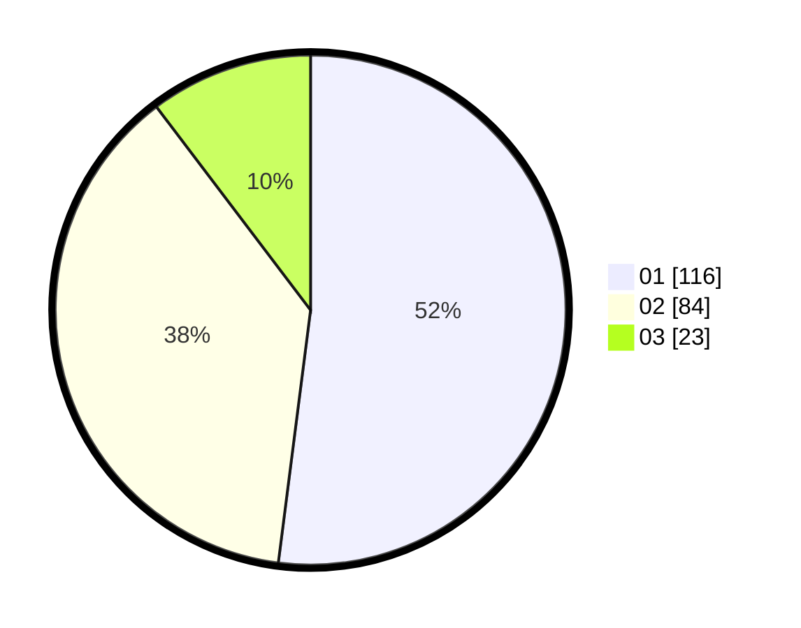

# Hasil

Hasil perolehan suara paslon dapat dilihat pada file paslon-01.txt, paslon-02.txt, dan paslon-03.txt.

Jika tidak ada, artinya data tersebut belum ada pada SIREKAP.

## Perolehan Suara

 * Paslon 01: **116**.
 * Paslon 02: **84**.
 * Paslon 03: **23**.

## Foto C Plano

https://sirekap-obj-formc.kpu.go.id/af3d/pemilu/ppwp/31/74/01/10/01/3174011001052-20240214-201515--b4bc77ae-54ce-40aa-944a-b085129272a6.jpg

https://sirekap-obj-formc.kpu.go.id/af3d/pemilu/ppwp/31/74/01/10/01/3174011001052-20240214-201520--faffaf7e-8215-4244-96af-0506976ec49c.jpg

https://sirekap-obj-formc.kpu.go.id/af3d/pemilu/ppwp/31/74/01/10/01/3174011001052-20240214-201525--79b9b781-65c3-4727-9805-47ac2680732f.jpg

## DATA PEMILIH TETAP

Jumlah pemilih dalam DPT: **272**.
 * L: **133**.
 * P: **139**.

## DATA PENGGUNA HAK PILIH

Jumlah pengguna hak pilih dalam DPT: **222**.
 * L: **104**.
 * P: **118**.

Jumlah pengguna hak pilih dalam DPTb: **3**.
 * L: **2**.
 * P: **1**.

Jumlah pengguna hak pilih dalam DPK: **0**.
 * L: **0**.
 * P: **0**.

Jumlah pengguna hak pilih: **225**.
 * L: **106**.
 * P: **119**.

## JUMLAH SUARA SAH DAN TIDAK SAH

JUMLAH SELURUH SUARA SAH: **223**.

JUMLAH SUARA TIDAK SAH: **2**.

JUMLAH SELURUH SUARA SAH DAN SUARA TIDAK SAH: **225**.
