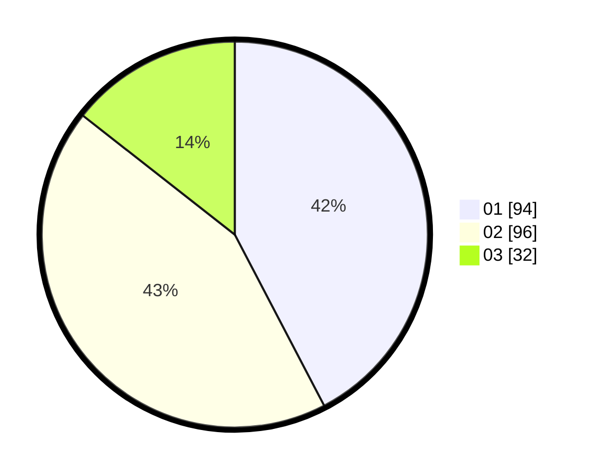

# Hasil

Hasil perolehan suara paslon dapat dilihat pada file paslon-01.txt, paslon-02.txt, dan paslon-03.txt.

Jika tidak ada, artinya data tersebut belum ada pada SIREKAP.

## Perolehan Suara

 * Paslon 01: **94**.
 * Paslon 02: **96**.
 * Paslon 03: **32**.

## Foto C Plano

https://sirekap-obj-formc.kpu.go.id/924b/pemilu/ppwp/31/74/01/10/01/3174011001058-20240214-222401--76041fdd-1014-4f72-9ae6-f18cdbb79b64.jpg

https://sirekap-obj-formc.kpu.go.id/924b/pemilu/ppwp/31/74/01/10/01/3174011001058-20240214-222446--dd434ace-3852-44bd-acc3-324433e2739a.jpg

https://sirekap-obj-formc.kpu.go.id/924b/pemilu/ppwp/31/74/01/10/01/3174011001058-20240214-222521--3db48ef2-89f2-485f-b037-aa02cb23f1c7.jpg

## DATA PEMILIH TETAP

Jumlah pemilih dalam DPT: **262**.
 * L: **134**.
 * P: **128**.

## DATA PENGGUNA HAK PILIH

Jumlah pengguna hak pilih dalam DPT: **214**.
 * L: **104**.
 * P: **110**.

Jumlah pengguna hak pilih dalam DPTb: **10**.
 * L: **6**.
 * P: **4**.

Jumlah pengguna hak pilih dalam DPK: **4**.
 * L: **2**.
 * P: **2**.

Jumlah pengguna hak pilih: **228**.
 * L: **112**.
 * P: **116**.

## JUMLAH SUARA SAH DAN TIDAK SAH

JUMLAH SELURUH SUARA SAH: **222**.

JUMLAH SUARA TIDAK SAH: **6**.

JUMLAH SELURUH SUARA SAH DAN SUARA TIDAK SAH: **228**.
