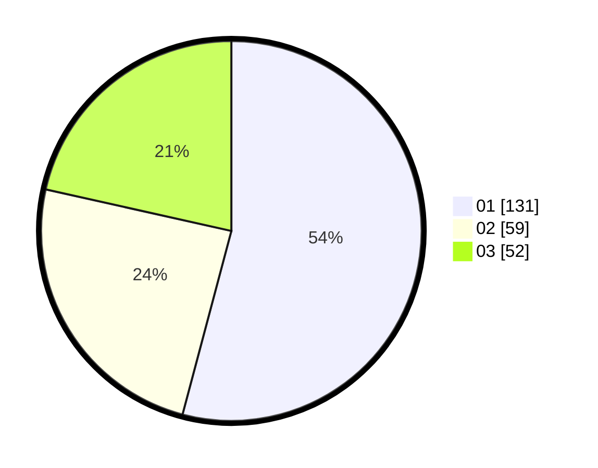

# Hasil

Hasil perolehan suara paslon dapat dilihat pada file paslon-01.txt, paslon-02.txt, dan paslon-03.txt.

Jika tidak ada, artinya data tersebut belum ada pada SIREKAP.

## Perolehan Suara

 * Paslon 01: **131**.
 * Paslon 02: **59**.
 * Paslon 03: **52**.

## Foto C Plano

https://sirekap-obj-formc.kpu.go.id/b353/pemilu/ppwp/31/74/01/10/01/3174011001061-20240216-041538--07f6f1c7-c37c-4836-a610-80b752045aad.jpg

https://sirekap-obj-formc.kpu.go.id/b353/pemilu/ppwp/31/74/01/10/01/3174011001061-20240214-162217--32718240-b124-456b-a8e1-b75f56d9d1c0.jpg

https://sirekap-obj-formc.kpu.go.id/b353/pemilu/ppwp/31/74/01/10/01/3174011001061-20240216-041543--44996bb4-61ff-4da6-947f-c992296ffd09.jpg

## DATA PEMILIH TETAP

Jumlah pemilih dalam DPT: **0**.
 * L: **0**.
 * P: **0**.

## DATA PENGGUNA HAK PILIH

Jumlah pengguna hak pilih dalam DPT: **0**.
 * L: **0**.
 * P: **0**.

Jumlah pengguna hak pilih dalam DPTb: **0**.
 * L: **0**.
 * P: **0**.

Jumlah pengguna hak pilih dalam DPK: **0**.
 * L: **0**.
 * P: **0**.

Jumlah pengguna hak pilih: **0**.
 * L: **0**.
 * P: **0**.

## JUMLAH SUARA SAH DAN TIDAK SAH

JUMLAH SELURUH SUARA SAH: **242**.

JUMLAH SUARA TIDAK SAH: **2**.

JUMLAH SELURUH SUARA SAH DAN SUARA TIDAK SAH: **244**.
