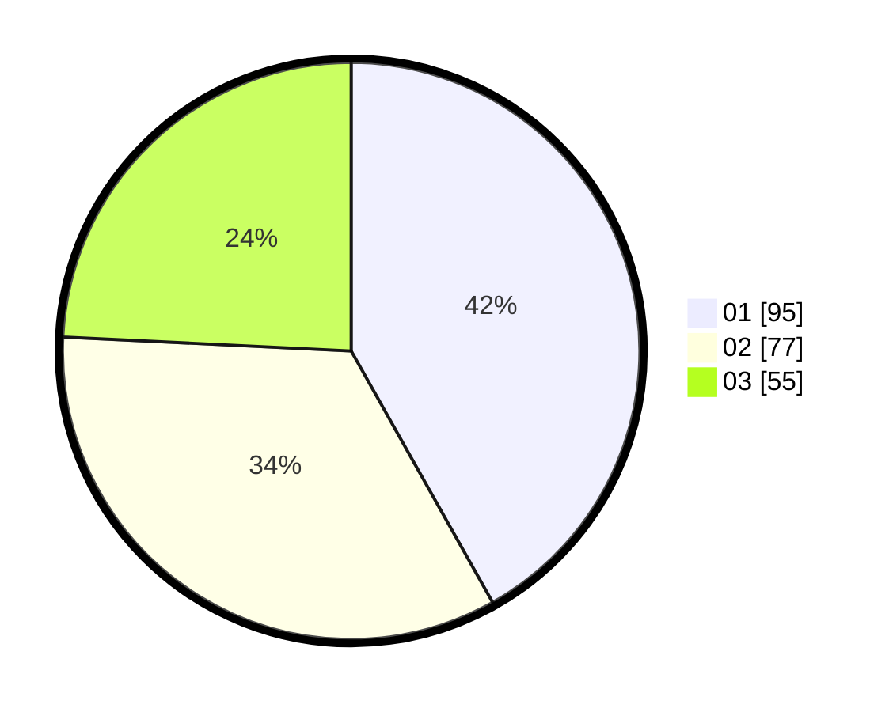

# Hasil

Hasil perolehan suara paslon dapat dilihat pada file paslon-01.txt, paslon-02.txt, dan paslon-03.txt.

Jika tidak ada, artinya data tersebut belum ada pada SIREKAP.

## Perolehan Suara

 * Paslon 01: **95**.
 * Paslon 02: **77**.
 * Paslon 03: **55**.

## Foto C Plano

https://sirekap-obj-formc.kpu.go.id/44ec/pemilu/ppwp/31/74/01/10/01/3174011001062-20240214-184641--77067841-62ec-4128-b994-94f4f5a70b4b.jpg

https://sirekap-obj-formc.kpu.go.id/44ec/pemilu/ppwp/31/74/01/10/01/3174011001062-20240214-184652--26484cbb-5775-42dd-83c8-8e358d686f61.jpg

https://sirekap-obj-formc.kpu.go.id/44ec/pemilu/ppwp/31/74/01/10/01/3174011001062-20240214-184655--8e9fc565-36d3-48bb-ad0d-5ce4f1139cd3.jpg

## DATA PEMILIH TETAP

Jumlah pemilih dalam DPT: **255**.
 * L: **128**.
 * P: **127**.

## DATA PENGGUNA HAK PILIH

Jumlah pengguna hak pilih dalam DPT: **213**.
 * L: **106**.
 * P: **107**.

Jumlah pengguna hak pilih dalam DPTb: **16**.
 * L: **4**.
 * P: **12**.

Jumlah pengguna hak pilih dalam DPK: **0**.
 * L: **0**.
 * P: **0**.

Jumlah pengguna hak pilih: **229**.
 * L: **110**.
 * P: **119**.

## JUMLAH SUARA SAH DAN TIDAK SAH

JUMLAH SELURUH SUARA SAH: **227**.

JUMLAH SUARA TIDAK SAH: **2**.

JUMLAH SELURUH SUARA SAH DAN SUARA TIDAK SAH: **229**.
