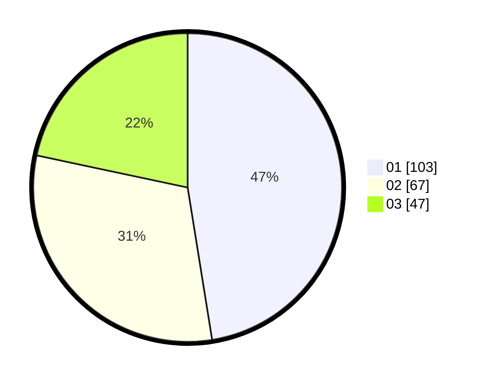

# Hasil

Hasil perolehan suara paslon dapat dilihat pada file paslon-01.txt, paslon-02.txt, dan paslon-03.txt.

Jika tidak ada, artinya data tersebut belum ada pada SIREKAP.

## Perolehan Suara

 * Paslon 01: **103**.
 * Paslon 02: **67**.
 * Paslon 03: **47**.

## Foto C Plano

https://sirekap-obj-formc.kpu.go.id/60f7/pemilu/ppwp/31/74/01/10/02/3174011002001-20240214-155721--31263240-7b61-48ac-9662-9347014c74d3.jpg

https://sirekap-obj-formc.kpu.go.id/60f7/pemilu/ppwp/31/74/01/10/02/3174011002001-20240214-160128--fa173fe0-4d1c-4146-99bc-e7fcff7f78c0.jpg

https://sirekap-obj-formc.kpu.go.id/60f7/pemilu/ppwp/31/74/01/10/02/3174011002001-20240214-162243--28b8d300-d474-40a1-855d-0d538e632d22.jpg

## DATA PEMILIH TETAP

Jumlah pemilih dalam DPT: **267**.
 * L: **124**.
 * P: **143**.

## DATA PENGGUNA HAK PILIH

Jumlah pengguna hak pilih dalam DPT: **207**.
 * L: **89**.
 * P: **118**.

Jumlah pengguna hak pilih dalam DPTb: **11**.
 * L: **3**.
 * P: **8**.

Jumlah pengguna hak pilih dalam DPK: **2**.
 * L: **1**.
 * P: **1**.

Jumlah pengguna hak pilih: **220**.
 * L: **93**.
 * P: **127**.

## JUMLAH SUARA SAH DAN TIDAK SAH

JUMLAH SELURUH SUARA SAH: **217**.

JUMLAH SUARA TIDAK SAH: **3**.

JUMLAH SELURUH SUARA SAH DAN SUARA TIDAK SAH: **220**.
