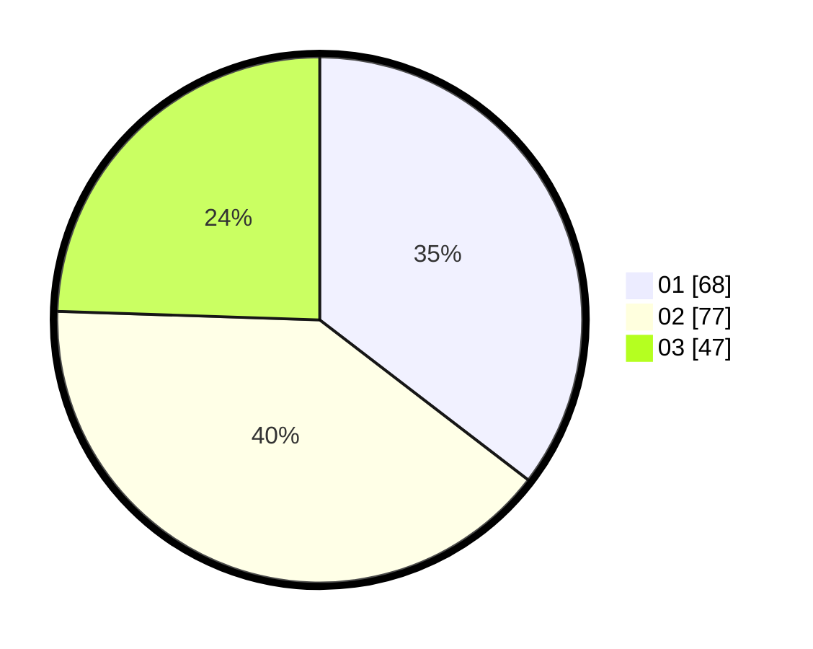

# Hasil

Hasil perolehan suara paslon dapat dilihat pada file paslon-01.txt, paslon-02.txt, dan paslon-03.txt.

Jika tidak ada, artinya data tersebut belum ada pada SIREKAP.

## Perolehan Suara

 * Paslon 01: **68**.
 * Paslon 02: **77**.
 * Paslon 03: **47**.

## Foto C Plano

https://sirekap-obj-formc.kpu.go.id/d6b0/pemilu/ppwp/31/74/01/10/02/3174011002006-20240215-223744--6450e154-f81b-4573-a501-375f8fec561c.jpg

https://sirekap-obj-formc.kpu.go.id/d6b0/pemilu/ppwp/31/74/01/10/02/3174011002006-20240215-223746--bfe40f0c-4f14-4c62-90b7-c23adda17c69.jpg

https://sirekap-obj-formc.kpu.go.id/d6b0/pemilu/ppwp/31/74/01/10/02/3174011002006-20240215-223745--cdceffb4-7ad5-463a-ad2e-b194d93e5b15.jpg

## DATA PEMILIH TETAP

Jumlah pemilih dalam DPT: **227**.
 * L: **115**.
 * P: **112**.

## DATA PENGGUNA HAK PILIH

Jumlah pengguna hak pilih dalam DPT: **177**.
 * L: **87**.
 * P: **90**.

Jumlah pengguna hak pilih dalam DPTb: **14**.
 * L: **4**.
 * P: **10**.

Jumlah pengguna hak pilih dalam DPK: **1**.
 * L: **0**.
 * P: **1**.

Jumlah pengguna hak pilih: **192**.
 * L: **91**.
 * P: **101**.

## JUMLAH SUARA SAH DAN TIDAK SAH

JUMLAH SELURUH SUARA SAH: **192**.

JUMLAH SUARA TIDAK SAH: **0**.

JUMLAH SELURUH SUARA SAH DAN SUARA TIDAK SAH: **192**.
