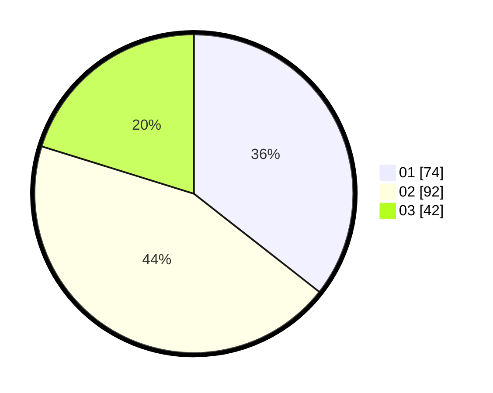

# Hasil

Hasil perolehan suara paslon dapat dilihat pada file paslon-01.txt, paslon-02.txt, dan paslon-03.txt.

Jika tidak ada, artinya data tersebut belum ada pada SIREKAP.

## Perolehan Suara

 * Paslon 01: **74**.
 * Paslon 02: **92**.
 * Paslon 03: **42**.

## Foto C Plano

https://sirekap-obj-formc.kpu.go.id/328f/pemilu/ppwp/31/74/01/10/02/3174011002010-20240216-210141--f3c66b6d-5c9a-4392-9940-c005c0206da3.jpg

https://sirekap-obj-formc.kpu.go.id/328f/pemilu/ppwp/31/74/01/10/02/3174011002010-20240216-210143--4bb100b0-7760-4a83-b3f5-27570ed80259.jpg

https://sirekap-obj-formc.kpu.go.id/328f/pemilu/ppwp/31/74/01/10/02/3174011002010-20240216-210142--fe47bc18-4891-4dd3-9531-8b4e37487027.jpg

## DATA PEMILIH TETAP

Jumlah pemilih dalam DPT: **250**.
 * L: **122**.
 * P: **128**.

## DATA PENGGUNA HAK PILIH

Jumlah pengguna hak pilih dalam DPT: **197**.
 * L: **99**.
 * P: **98**.

Jumlah pengguna hak pilih dalam DPTb: **7**.
 * L: **4**.
 * P: **3**.

Jumlah pengguna hak pilih dalam DPK: **7**.
 * L: **2**.
 * P: **5**.

Jumlah pengguna hak pilih: **211**.
 * L: **105**.
 * P: **106**.

## JUMLAH SUARA SAH DAN TIDAK SAH

JUMLAH SELURUH SUARA SAH: **208**.

JUMLAH SUARA TIDAK SAH: **3**.

JUMLAH SELURUH SUARA SAH DAN SUARA TIDAK SAH: **211**.
