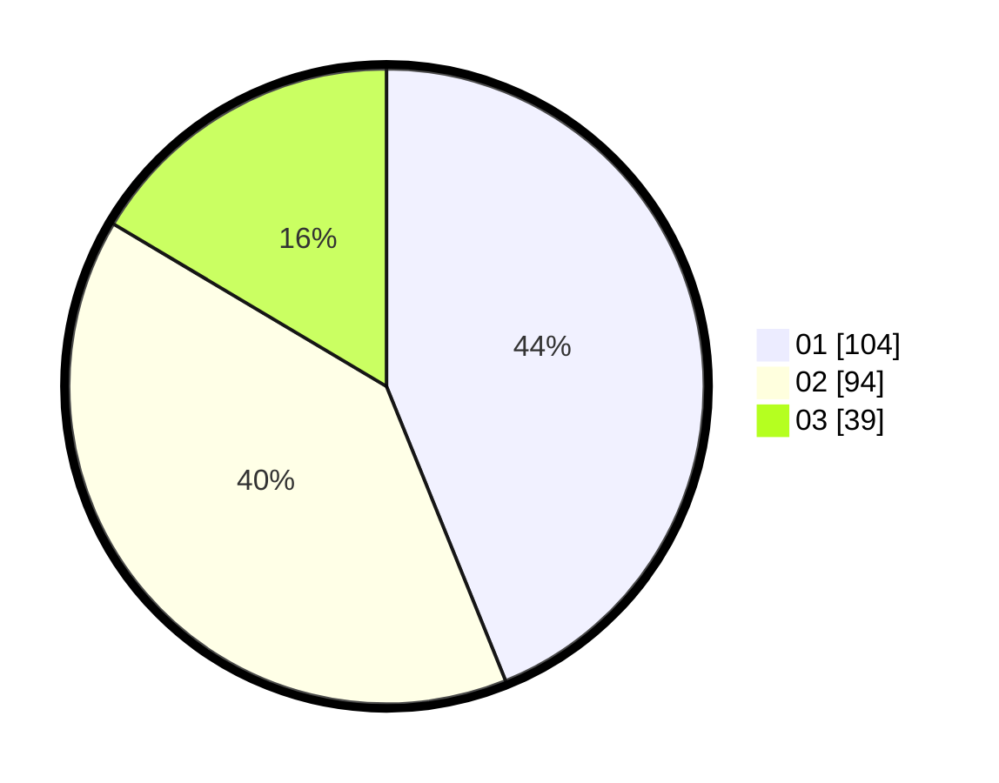

# Hasil

Hasil perolehan suara paslon dapat dilihat pada file paslon-01.txt, paslon-02.txt, dan paslon-03.txt.

Jika tidak ada, artinya data tersebut belum ada pada SIREKAP.

## Perolehan Suara

 * Paslon 01: **104**.
 * Paslon 02: **94**.
 * Paslon 03: **39**.

## Foto C Plano

https://sirekap-obj-formc.kpu.go.id/8a3a/pemilu/ppwp/31/74/01/10/02/3174011002019-20240214-194016--8ae39169-aa7c-4e92-91e1-9b025408a2d5.jpg

https://sirekap-obj-formc.kpu.go.id/8a3a/pemilu/ppwp/31/74/01/10/02/3174011002019-20240214-194349--8127c7c4-2086-431c-b064-7148edde85ce.jpg

https://sirekap-obj-formc.kpu.go.id/8a3a/pemilu/ppwp/31/74/01/10/02/3174011002019-20240214-194353--9dc9e7b3-bfa7-43d7-a4a6-013c3edf727f.jpg
