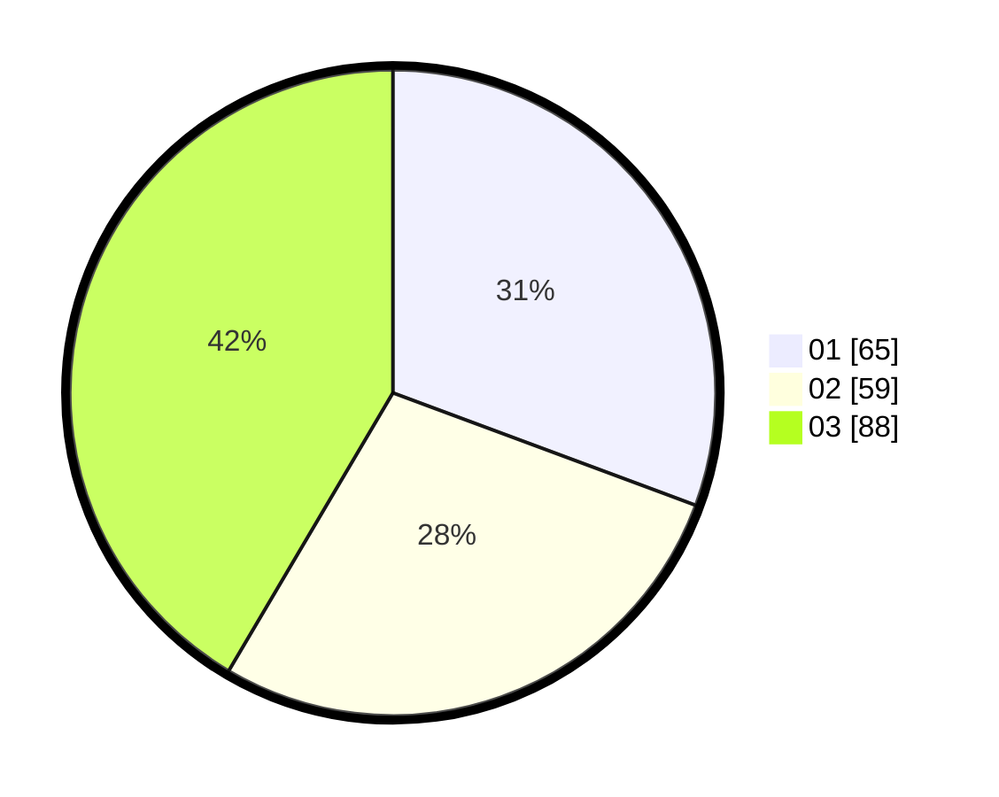

# Hasil

Hasil perolehan suara paslon dapat dilihat pada file paslon-01.txt, paslon-02.txt, dan paslon-03.txt.

Jika tidak ada, artinya data tersebut belum ada pada SIREKAP.

## Perolehan Suara

 * Paslon 01: **65**.
 * Paslon 02: **59**.
 * Paslon 03: **88**.

## Foto C Plano

https://sirekap-obj-formc.kpu.go.id/267f/pemilu/ppwp/31/74/01/10/02/3174011002021-20240214-234028--02075c27-175a-490c-bce5-6d59351179f8.jpg

https://sirekap-obj-formc.kpu.go.id/267f/pemilu/ppwp/31/74/01/10/02/3174011002021-20240214-234542--084e59c6-4e5f-4f68-986e-0a86583f1364.jpg

https://sirekap-obj-formc.kpu.go.id/267f/pemilu/ppwp/31/74/01/10/02/3174011002021-20240214-234253--39166dff-e854-44df-8199-603b08dbc580.jpg

## DATA PEMILIH TETAP

Jumlah pemilih dalam DPT: **242**.
 * L: **104**.
 * P: **138**.

## DATA PENGGUNA HAK PILIH

Jumlah pengguna hak pilih dalam DPT: **192**.
 * L: **80**.
 * P: **112**.

Jumlah pengguna hak pilih dalam DPTb: **17**.
 * L: **5**.
 * P: **12**.

Jumlah pengguna hak pilih dalam DPK: **3**.
 * L: **2**.
 * P: **1**.

Jumlah pengguna hak pilih: **212**.
 * L: **87**.
 * P: **125**.

## JUMLAH SUARA SAH DAN TIDAK SAH

JUMLAH SELURUH SUARA SAH: **212**.

JUMLAH SUARA TIDAK SAH: **0**.

JUMLAH SELURUH SUARA SAH DAN SUARA TIDAK SAH: **212**.
