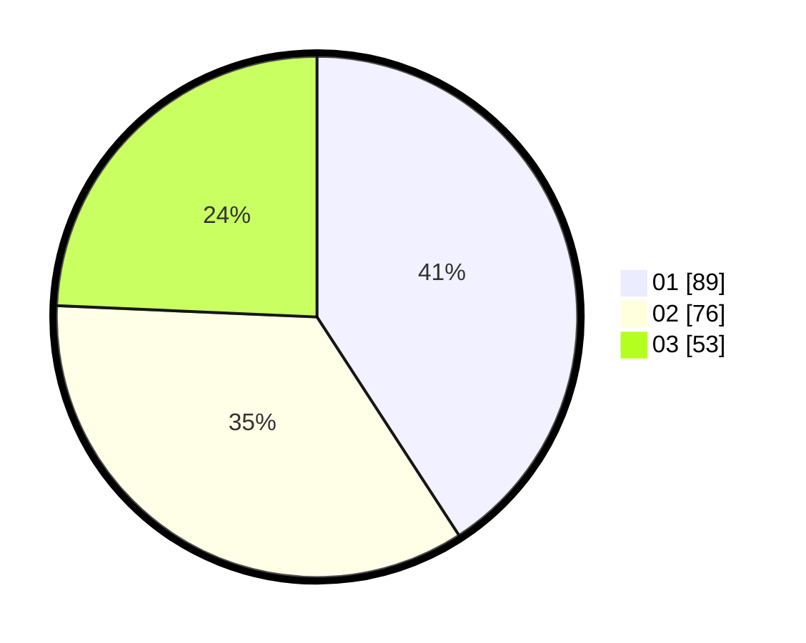

# Hasil

Hasil perolehan suara paslon dapat dilihat pada file paslon-01.txt, paslon-02.txt, dan paslon-03.txt.

Jika tidak ada, artinya data tersebut belum ada pada SIREKAP.

## Perolehan Suara

 * Paslon 01: **89**.
 * Paslon 02: **76**.
 * Paslon 03: **53**.

## Foto C Plano

https://sirekap-obj-formc.kpu.go.id/84d4/pemilu/ppwp/31/74/01/10/02/3174011002022-20240218-153519--5d5e7047-5819-4777-be2e-c788279bd6f7.jpg

https://sirekap-obj-formc.kpu.go.id/84d4/pemilu/ppwp/31/74/01/10/02/3174011002022-20240216-112412--4981dbcd-739e-4f4f-b1e4-adf5f5c5fff5.jpg

https://sirekap-obj-formc.kpu.go.id/84d4/pemilu/ppwp/31/74/01/10/02/3174011002022-20240216-112420--654a9517-2e94-44e5-abd5-d7ca3d48416d.jpg
