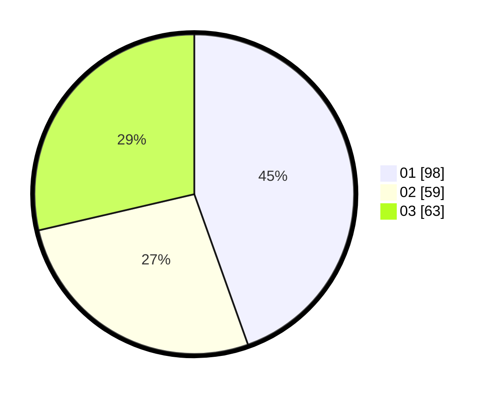

# Hasil

Hasil perolehan suara paslon dapat dilihat pada file paslon-01.txt, paslon-02.txt, dan paslon-03.txt.

Jika tidak ada, artinya data tersebut belum ada pada SIREKAP.

## Perolehan Suara

 * Paslon 01: **98**.
 * Paslon 02: **59**.
 * Paslon 03: **63**.

## Foto C Plano

https://sirekap-obj-formc.kpu.go.id/88ea/pemilu/ppwp/31/74/01/10/02/3174011002024-20240216-131134--5a55d3bf-ae46-4f52-8587-489e077ed204.jpg

https://sirekap-obj-formc.kpu.go.id/88ea/pemilu/ppwp/31/74/01/10/02/3174011002024-20240216-131136--24c51b2a-277e-461f-af54-402980062c49.jpg

https://sirekap-obj-formc.kpu.go.id/88ea/pemilu/ppwp/31/74/01/10/02/3174011002024-20240216-131135--54b5dae2-fcd1-4677-bb82-0c7c62aa0fd1.jpg

## DATA PEMILIH TETAP

Jumlah pemilih dalam DPT: **262**.
 * L: **123**.
 * P: **139**.

## DATA PENGGUNA HAK PILIH

Jumlah pengguna hak pilih dalam DPT: **209**.
 * L: **93**.
 * P: **116**.

Jumlah pengguna hak pilih dalam DPTb: **15**.
 * L: **7**.
 * P: **8**.

Jumlah pengguna hak pilih dalam DPK: **0**.
 * L: **0**.
 * P: **0**.

Jumlah pengguna hak pilih: **224**.
 * L: **100**.
 * P: **124**.

## JUMLAH SUARA SAH DAN TIDAK SAH

JUMLAH SELURUH SUARA SAH: **220**.

JUMLAH SUARA TIDAK SAH: **4**.

JUMLAH SELURUH SUARA SAH DAN SUARA TIDAK SAH: **224**.
