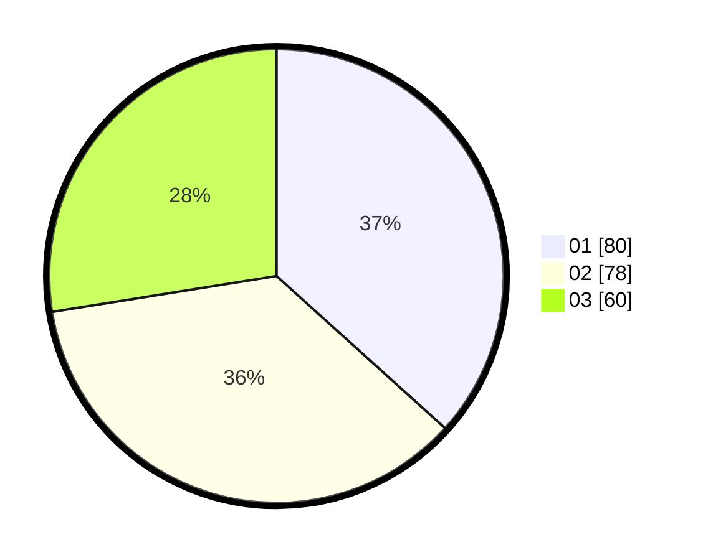

# Hasil

Hasil perolehan suara paslon dapat dilihat pada file paslon-01.txt, paslon-02.txt, dan paslon-03.txt.

Jika tidak ada, artinya data tersebut belum ada pada SIREKAP.

## Perolehan Suara

 * Paslon 01: **80**.
 * Paslon 02: **78**.
 * Paslon 03: **60**.

## Foto C Plano

https://sirekap-obj-formc.kpu.go.id/eb3e/pemilu/ppwp/31/74/01/10/02/3174011002029-20240214-225247--bc2eb76f-77dd-49ac-95d4-20f69f4d9538.jpg

https://sirekap-obj-formc.kpu.go.id/eb3e/pemilu/ppwp/31/74/01/10/02/3174011002029-20240214-205254--3ea1d526-0bc0-4026-ae2e-61d2607cf83c.jpg

https://sirekap-obj-formc.kpu.go.id/eb3e/pemilu/ppwp/31/74/01/10/02/3174011002029-20240214-205325--ea5f97b0-0857-4dd0-a3f7-fa925cd3f803.jpg
