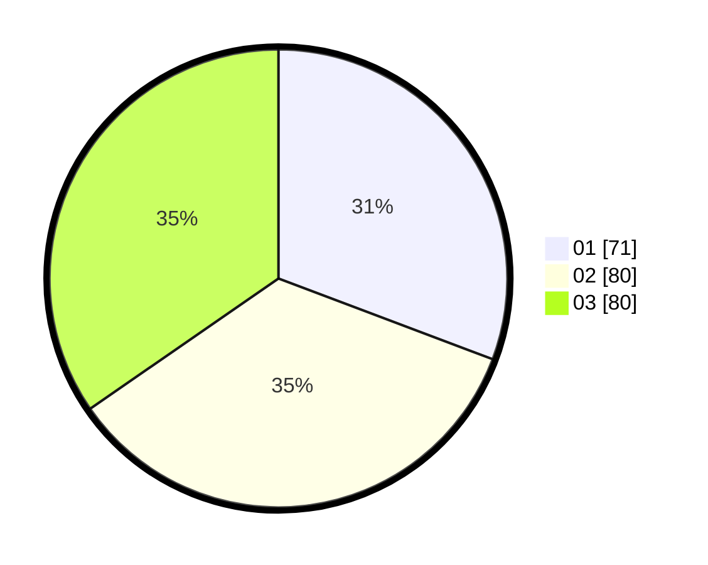

# Hasil

Hasil perolehan suara paslon dapat dilihat pada file paslon-01.txt, paslon-02.txt, dan paslon-03.txt.

Jika tidak ada, artinya data tersebut belum ada pada SIREKAP.

## Perolehan Suara

 * Paslon 01: **71**.
 * Paslon 02: **80**.
 * Paslon 03: **80**.

## Foto C Plano

https://sirekap-obj-formc.kpu.go.id/3cff/pemilu/ppwp/31/74/01/10/02/3174011002030-20240214-195529--055dd64d-ccd6-4bdd-a2e6-7a68affa5a6a.jpg

https://sirekap-obj-formc.kpu.go.id/3cff/pemilu/ppwp/31/74/01/10/02/3174011002030-20240214-195549--1409d48a-04cf-439a-9788-a45f2f283c40.jpg

https://sirekap-obj-formc.kpu.go.id/3cff/pemilu/ppwp/31/74/01/10/02/3174011002030-20240214-195603--380f7d01-c219-4f34-9fb7-0a0a6c1a08fd.jpg

## DATA PEMILIH TETAP

Jumlah pemilih dalam DPT: **263**.
 * L: **120**.
 * P: **143**.

## DATA PENGGUNA HAK PILIH

Jumlah pengguna hak pilih dalam DPT: **212**.
 * L: **93**.
 * P: **119**.

Jumlah pengguna hak pilih dalam DPTb: **21**.
 * L: **13**.
 * P: **8**.

Jumlah pengguna hak pilih dalam DPK: **0**.
 * L: **0**.
 * P: **0**.

Jumlah pengguna hak pilih: **233**.
 * L: **106**.
 * P: **127**.

## JUMLAH SUARA SAH DAN TIDAK SAH

JUMLAH SELURUH SUARA SAH: **231**.

JUMLAH SUARA TIDAK SAH: **2**.

JUMLAH SELURUH SUARA SAH DAN SUARA TIDAK SAH: **233**.
