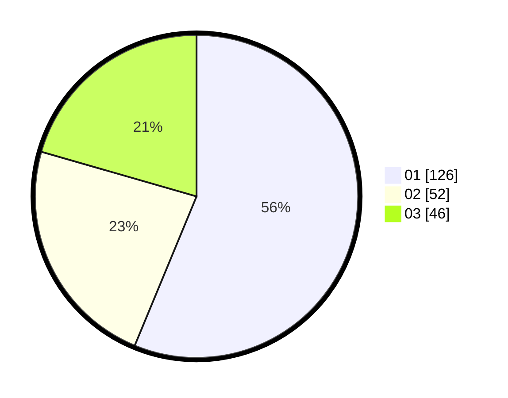

# Hasil

Hasil perolehan suara paslon dapat dilihat pada file paslon-01.txt, paslon-02.txt, dan paslon-03.txt.

Jika tidak ada, artinya data tersebut belum ada pada SIREKAP.

## Perolehan Suara

 * Paslon 01: **126**.
 * Paslon 02: **52**.
 * Paslon 03: **46**.

## Foto C Plano

https://sirekap-obj-formc.kpu.go.id/115d/pemilu/ppwp/31/74/01/10/02/3174011002039-20240214-213748--61eacb61-a57d-40f9-a545-9393a4bf4aec.jpg

https://sirekap-obj-formc.kpu.go.id/115d/pemilu/ppwp/31/74/01/10/02/3174011002039-20240214-203520--5b603fad-3acf-4920-bb13-ba562557c191.jpg

https://sirekap-obj-formc.kpu.go.id/115d/pemilu/ppwp/31/74/01/10/02/3174011002039-20240214-211353--ed70954c-c598-4a4c-b2e5-1c1c8ccf8ada.jpg

## DATA PEMILIH TETAP

Jumlah pemilih dalam DPT: **245**.
 * L: **111**.
 * P: **134**.

## DATA PENGGUNA HAK PILIH

Jumlah pengguna hak pilih dalam DPT: **207**.
 * L: **90**.
 * P: **117**.

Jumlah pengguna hak pilih dalam DPTb: **17**.
 * L: **10**.
 * P: **7**.

Jumlah pengguna hak pilih dalam DPK: **2**.
 * L: **1**.
 * P: **1**.

Jumlah pengguna hak pilih: **226**.
 * L: **101**.
 * P: **125**.

## JUMLAH SUARA SAH DAN TIDAK SAH

JUMLAH SELURUH SUARA SAH: **224**.

JUMLAH SUARA TIDAK SAH: **2**.

JUMLAH SELURUH SUARA SAH DAN SUARA TIDAK SAH: **226**.
